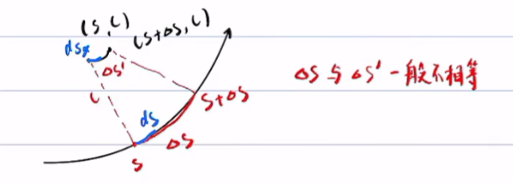
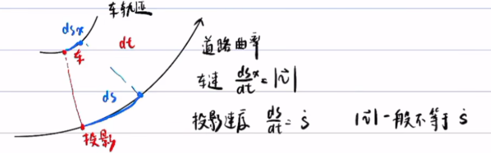
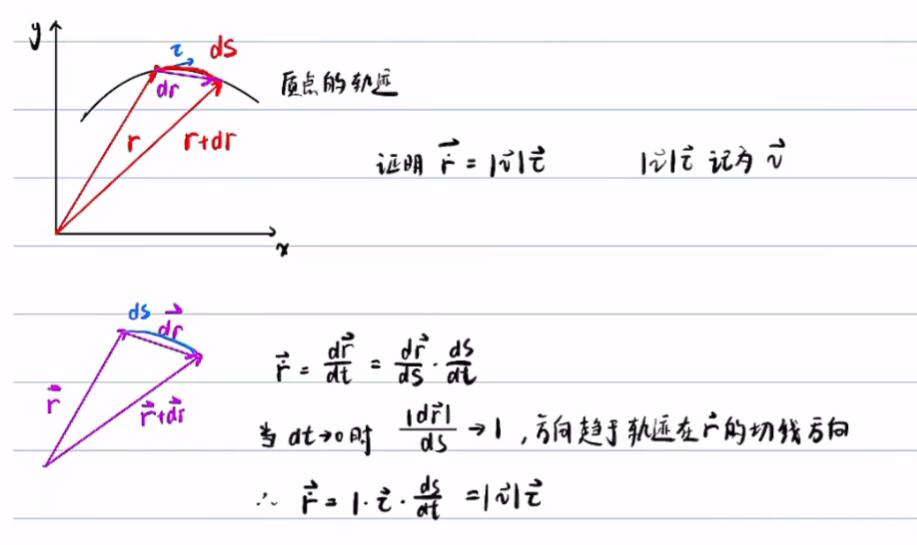
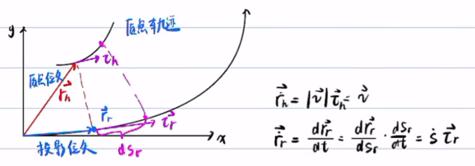
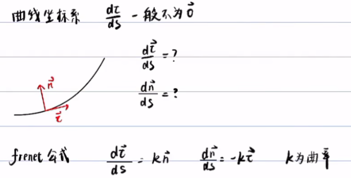
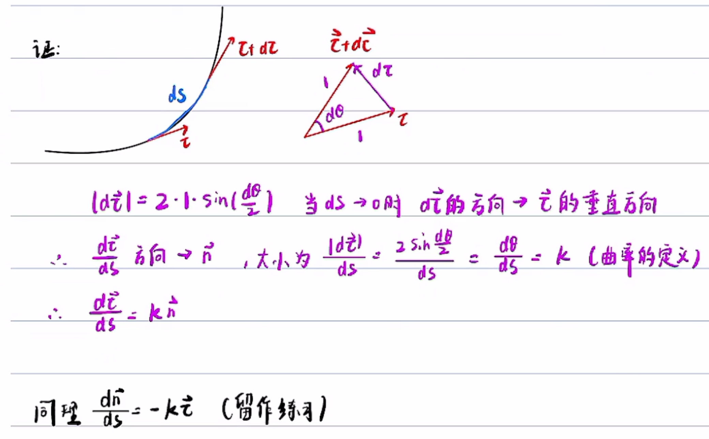
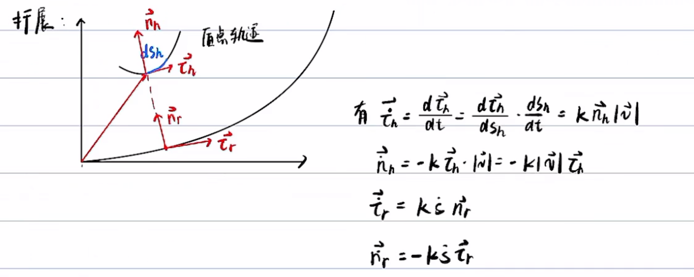
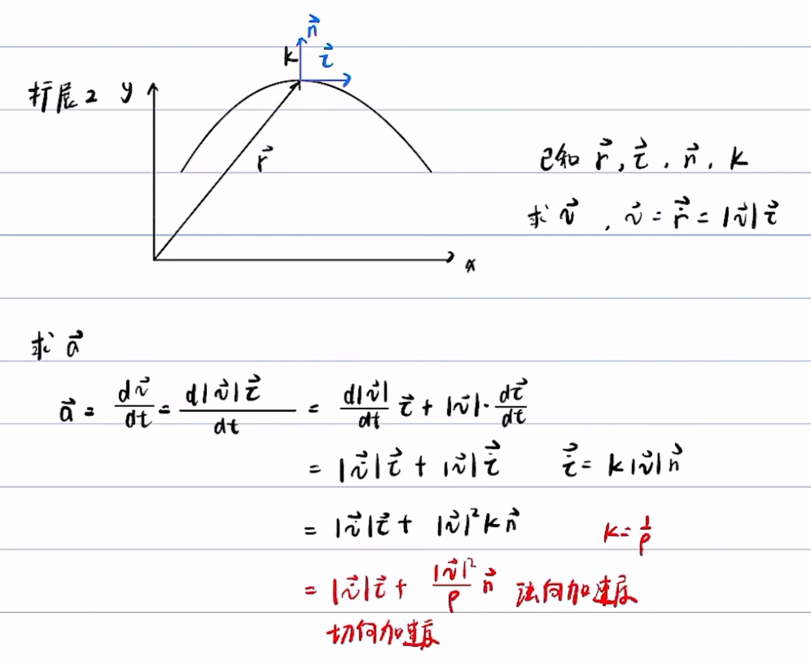
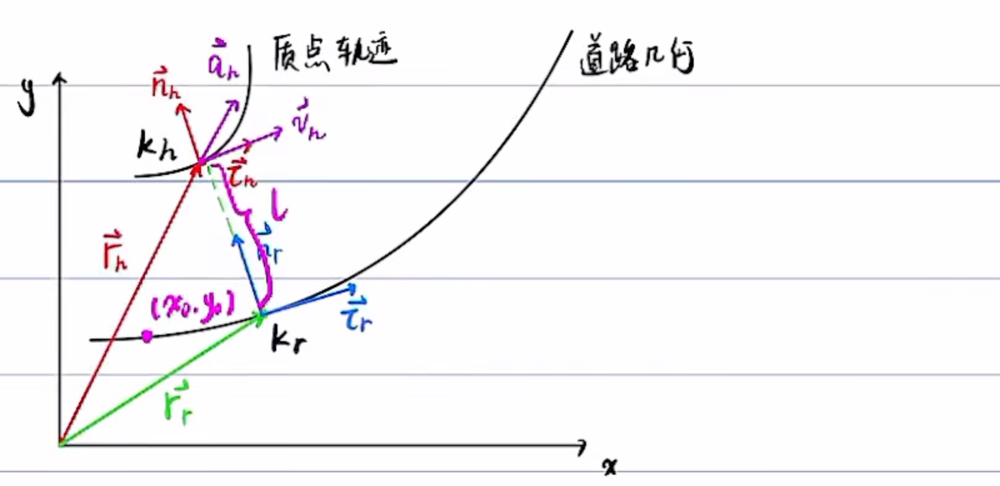

# Frenet坐标系和Cartesian坐标系

**龙格现象**：高次多项式的拟合可能出现振荡，尽可能用分段低次多项式

## 问题描述

车: host vehicle
已知车在Cartesian坐标系下的位置 $r_h$, 速度 $v_h$, 加速度 $a_h$, 曲率 $k_h$，求车以道路为坐标轴的frenet坐标系下的坐标:  $$s,\dot{s},\ddot{s},l,l',l'',\dot{l},\ddot{l}$$
其中，$$\dot{s}=\frac{ds}{dt},\dot{l}=\frac{dl}{dt},l'=\frac{dl}{ds}$$
对于 EM Planner，求 $s,\dot{s},\ddot{s},l,l',l''$  
对于 Lattice Planner，求 $s,\dot{s},\ddot{s},l,\dot{l},\ddot{l}$

$l',l'',\dot{l},\ddot{l}$ 可以互相转化：
$$
\begin{aligned}
& l=\frac{d l}{d t}=\frac{d l}{d s} \cdot \frac{d s}{d t}=l^{\prime} \dot{s} \\
& \ddot{l}=\frac{d \dot{l}}{d t}=\frac{d\left(l^{\prime} \dot{s}\right)}{d t}=\frac{d l^{\prime}}{d t} \dot{s}+l^{\prime} \cdot \frac{d \dot{s}}{d t}=\frac{d l^{\prime}}{d s} \cdot \frac{d s}{d t} \cdot \dot{s}+l^{\prime} \cdot \frac{d \dot{s}}{d t}=l^{\prime \prime} \dot{s}^2+l^{\prime} \ddot{s}
\end{aligned}
$$

**曲线坐标系与直接坐标系的不通**：
+ 曲线坐标系的基向量一般不是常向量
+ 点的曲线坐标变化与点的实际位移不一致

第一点解释：

第二点解释：
直角坐标系只有 $\frac{dy}{dx}$，自然坐标系有 $\frac{d}{ds},\frac{d}{ds_x}$  

## 预备知识

### 车辆位矢及车道线投影位矢的导数

扩展：

### Frenet公式

证明：

 
 扩展1:

扩展2:

### 总结

已知 $\vec{r_h},\vec{v_h},\vec{a_h},k_h,\vec{\tau_h},\vec{n_h}$，  
已知 Frenet 坐标系起点 $(x_0, y_0)$   
求 $s,\dot{s},\ddot{s},l,\dot{l},\ddot{l}$

| 符号           | 含义                             | 符号           | 含义                               |
| -------------- | -------------------------------- | -------------- | ---------------------------------- |
| $\vec{r_h}$    | 车的位矢                         | $\vec{r_r}$    | 投影位矢                           |
| $\vec{v}$      | 车的速度                         | $\dot{s}$      | 投影速率                           |
| $\vec{a}$      | 车的加速度                       | $k_r$          | 投影位矢在道路几何上的曲率         |
| $k_h$          | 车的位矢在车轨迹上的曲率         | $\vec{\tau_r}$ | 投影位矢在道路几何上切向的单位向量 |
| $\vec{\tau_h}$ | 车的位矢在车轨迹上的切向单位向量 | $\vec{n_r}$    | 投影位矢在道路几何上法向的单位向量 |
| $\vec{n_h}$    | 车的位矢在车轨迹上的法向单位向量 |                |                                    |
|                |                                  |                |                                    |
|                |                                  |                |                                    |

辅助公式：
$$
\begin{aligned}
\vec{\dot{r_h}} &= \vec{v} = |\vec{v}|\vec{\tau_h}\\
\vec{\dot{r_r}} &= \dot{s}\vec{\tau_r}\\
\vec{\dot{\tau_h}} &= k_h|\vec{v}|\vec{n_h}\\
\vec{\dot{n_h}} &= -k_h|\vec{v}|\vec{\tau_h}\\
\vec{\dot{\tau_r}} &= k_r\dot{s}\vec{n_r}\\
\vec{\dot{n_r}} &= -k_r\dot{s}\vec{\tau_r}\\
\vec{a} &= |\vec{\dot{v}}|\vec{\tau_h}+|\vec{v}|^2k_h\vec{n_h}
\end{aligned}
$$

## Frenet 和 Cartesian的转换

核心步骤：
1. 7个辅助公式
2. 找到车在frenet坐标系的投影点在Cartesian的坐标，记为 $x_r,y_r,\theta_r,k_r$，则 $\vec{r_r}=(x_r,y_r),\vec{\tau_r}=(\cos\theta_r,\sin\theta_r),\vec{n_r}=(-\sin\theta_r,\cos\theta_r)$
3. 利用向量三角形 $\vec{r_r}+l\vec{n_r}=\vec{r_h}$ 和微积分，求出 $s,\dot{s},\ddot{s},l,\dot{l},\ddot{l}$

### 步骤三：利用 $\vec{r_r}+l\vec{n_r}=\vec{r_h}$

核心公式：$\vec{r_r}+l\vec{n_r}=\vec{r_h}$

(1) 计算 $l$ ：
+ $l\vec{n_r}=\vec{r_h}-\vec{r_r}$ 
+ 两边点乘 $\vec{n_r}$ 得 $l=(\vec{r_h}-\vec{r_r})\cdot\vec{n_r}$

(2) 计算 $\dot{s}$：
+ 两边求导 $\vec{\dot{r_r}}+l\vec{\dot{n_r}}+\dot{l}\vec{n_r}=\vec{\dot{r_h}}$
+ 代入辅助公式 $\dot{s}\vec{\tau_r}+l(-k_r\dot{s}\vec{\tau_r})+\dot{l}\vec{n_r}=\vec{v}$
+ 两边同乘 $\vec{\tau_r}$ 得 $\dot{s}+l(-k_r\dot{s})=\vec{v}\cdot\vec{\tau_r}$
+ $\dot{s}=\frac{\vec{v}\cdot\vec{\tau_r}}{1-lk_r}$

(3) 计算 $\dot{l}$：
+ $\dot{s}\vec{\tau_r}+l(-k_r\dot{s}\vec{\tau_r})+\dot{l}\vec{n_r}=\vec{v}$
+ 两边同乘 $n_r$ 得 $\dot{l}=\vec{v}\cdot\vec{n_r}$

(4) 计算 $l'$：
+ $l'=\frac{dl}{ds}=\frac{dl}{dt}\frac{dt}{ds}=\frac{\dot{l}}{\dot{s}}=(1-lk_r)\frac{\vec{v}\cdot\vec{n_r}}{\vec{v}\cdot\vec{\tau_r}}$

(5) 计算 $\ddot{s}$
$$
\ddot{s}=\frac{d\dot{s}}{dt}=\cdots=\frac{\vec{a}\cdot\vec{\tau_r}}{1-k_rl}+\frac{(k_r\dot{s})(\vec{v}\cdot\vec{n_r})}{1-k_rl}+\frac{\dot{s}^2}{1-k_rl}(k_r'l+k_rl')
$$