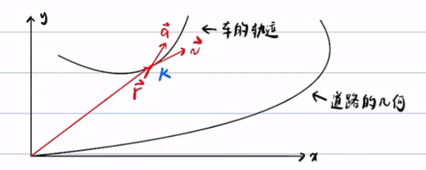
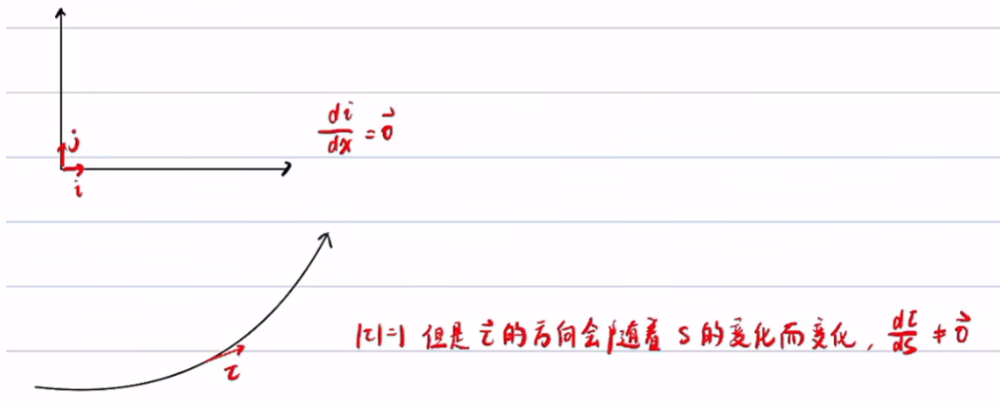

# Frenet坐标系和Cartesian坐标系

**龙格现象**：高次多项式的拟合可能出现振荡，尽可能用分段低次多项式

## 问题描述

车: host vehicle
已知车在Cartesian坐标系下的位置 $r_h$, 速度 $v_h$, 加速度 $a_h$, 曲率 $k_h$，求车以道路为坐标轴的frenet坐标系下的坐标:  $$s,\dot{s},\ddot{s},l,l',l'',\dot{l},\ddot{l}$$
其中，$$\dot{s}=\frac{ds}{dt},\dot{l}=\frac{dl}{dt},l'=\frac{dl}{ds}$$
对于 EM Planner，求 $s,\dot{s},\ddot{s},l,l',l''$  
对于 Lattice Planner，求 $s,\dot{s},\ddot{s},l,\dot{l},\ddot{l}$

$l',l'',\dot{l},\ddot{l}$ 可以互相转化：
$$
\begin{aligned}
& l=\frac{d l}{d t}=\frac{d l}{d s} \cdot \frac{d s}{d t}=l^{\prime} \dot{s} \\
& \ddot{l}=\frac{d \dot{l}}{d t}=\frac{d\left(l^{\prime} \dot{s}\right)}{d t}=\frac{d l^{\prime}}{d t} \dot{s}+l^{\prime} \cdot \frac{d \dot{s}}{d t}=\frac{d l^{\prime}}{d s} \cdot \frac{d s}{d t} \cdot \dot{s}+l^{\prime} \cdot \frac{d \dot{s}}{d t}=l^{\prime \prime} \dot{s}^2+l^{\prime} \ddot{s}
\end{aligned}
$$

**曲线坐标系与直接坐标系的不通**：
+ 曲线坐标系的基向量一般不是常向量
+ 点的曲线坐标变化与点的实际位移不一致

