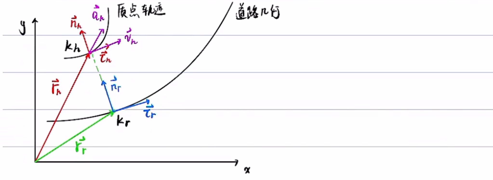

# Frenet坐标系和Cartesian坐标系

**龙格现象**：高次多项式的拟合可能出现振荡，尽可能用分段低次多项式

## 问题描述

车: host vehicle
已知车在Cartesian坐标系下的位置 $r_h$, 速度 $v_h$, 加速度 $a_h$, 曲率 $k_h$，求车以道路为坐标轴的frenet坐标系下的坐标:  $$s,\dot{s},\ddot{s},l,l',l'',\dot{l},\ddot{l}$$
其中，$$\dot{s}=\frac{ds}{dt},\dot{l}=\frac{dl}{dt},l'=\frac{dl}{ds}$$
对于 EM Planner，求 $s,\dot{s},\ddot{s},l,l',l''$  
对于 Lattice Planner，求 $s,\dot{s},\ddot{s},l,\dot{l},\ddot{l}$

$l',l'',\dot{l},\ddot{l}$ 可以互相转化：
$$
\begin{aligned}
& l=\frac{d l}{d t}=\frac{d l}{d s} \cdot \frac{d s}{d t}=l^{\prime} \dot{s} \\
& \ddot{l}=\frac{d \dot{l}}{d t}=\frac{d\left(l^{\prime} \dot{s}\right)}{d t}=\frac{d l^{\prime}}{d t} \dot{s}+l^{\prime} \cdot \frac{d \dot{s}}{d t}=\frac{d l^{\prime}}{d s} \cdot \frac{d s}{d t} \cdot \dot{s}+l^{\prime} \cdot \frac{d \dot{s}}{d t}=l^{\prime \prime} \dot{s}^2+l^{\prime} \ddot{s}
\end{aligned}
$$

**曲线坐标系与直接坐标系的不通**：
+ 曲线坐标系的基向量一般不是常向量
+ 点的曲线坐标变化与点的实际位移不一致

第一点解释：

第二点解释：
直角坐标系只有 $\frac{dy}{dx}$，自然坐标系有 $\frac{d}{ds},\frac{d}{ds_x}$  

## 预备知识

### 车辆位矢及车道线投影位矢的导数

扩展：

### Frenet公式

证明：

 
 扩展1:

扩展2:

### 总结

| 符号           | 含义                             | 符号           | 含义                                   |
| -------------- | -------------------------------- | -------------- | -------------------------------------- | 
| $\vec{r_h}$    | 车的位矢                         | $\vec{r_r}$    | 投影位矢                               |     
| $\vec{v}$      | 车的速度                         | $\dot{s}$      | 投影速率                               |    
| $\vec{a}$      | 车的加速度                       | $k_r$          | 投影位矢在道路几何上的曲率             | 
| $k_h$          | 车的位矢在车轨迹上的曲率         | $\vec{\tau_r}$ | 投影位矢在道路几何上切向的单位向量 | 
| $\vec{\tau_h}$ | 车的位矢在车轨迹上的切向单位向量 | $\vec{n_r}$    | 投影位矢在道路几何上法向的单位向量 | 
| $\vec{n_h}$    | 车的位矢在车轨迹上的法向单位向量 |                |                                        |

辅助公式：
$$
\begin{aligned}
\vec{\dot{r_h}} &= \vec{v} = |\vec{v}|\vec{\tau_h}\\
\vec{\dot{r_r}} &= \dot{s}\vec{\tau_r}\\
\vec{\dot{\tau_h}} &= k_h|\vec{v}|\vec{n_h}\\
\vec{\dot{n_h}} &= -k_h|\vec{v}|\vec{\tau_h}\\
\vec{\dot{\tau_r}} &= k_r\dot{s}\vec{n_r}\\
\vec{\dot{n_r}} &= -k_r\dot{s}\vec
\end{aligned}
$$