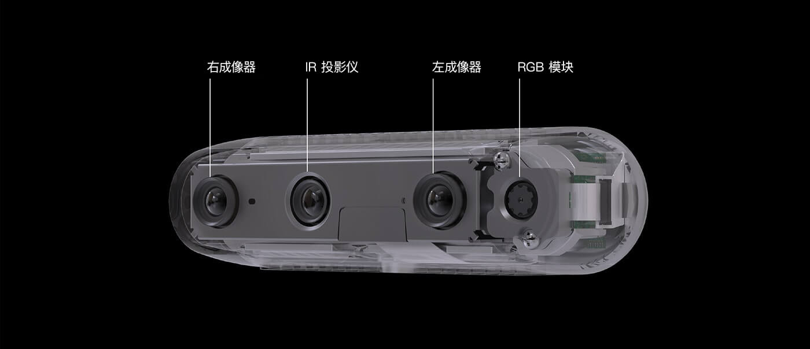
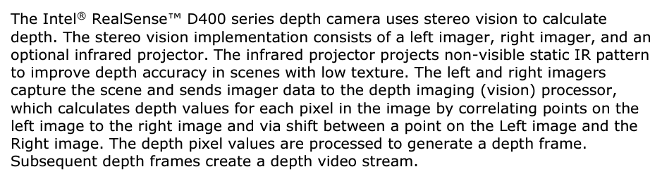
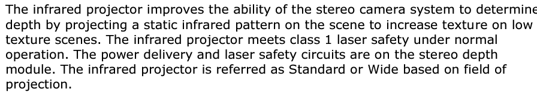
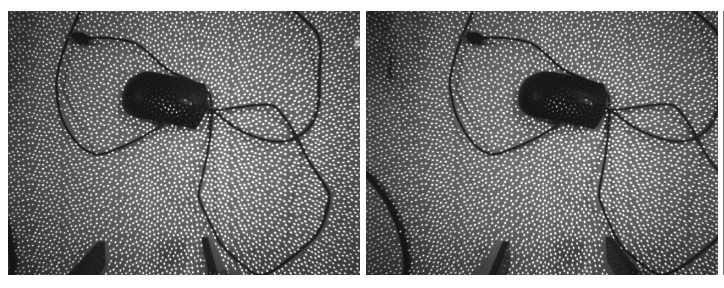

# Intel Realsense D435

## Technology Overview

D435的深度模块主要由左成像器、右成像器和IR投影仪构成。根据官方手册描述，

D435的深度方案主要是双目立体视觉，即通过匹配左右图像特征点来估计深度。IR投影仪只用于辅助双目视觉来提高低纹理场景下的深度精度，并不采用红外反射测距。

具体来说，IR投影仪会投射肉眼不可见的固定红外点阵，但左右红外相机能捕获该纹理特征，因此在低纹理场景下，相当于人工增加了纹理用于匹配特征。

