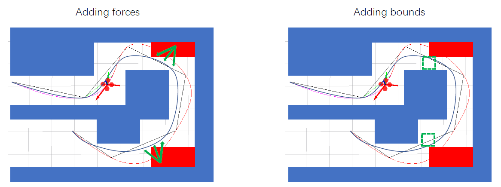
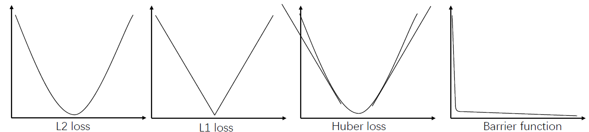
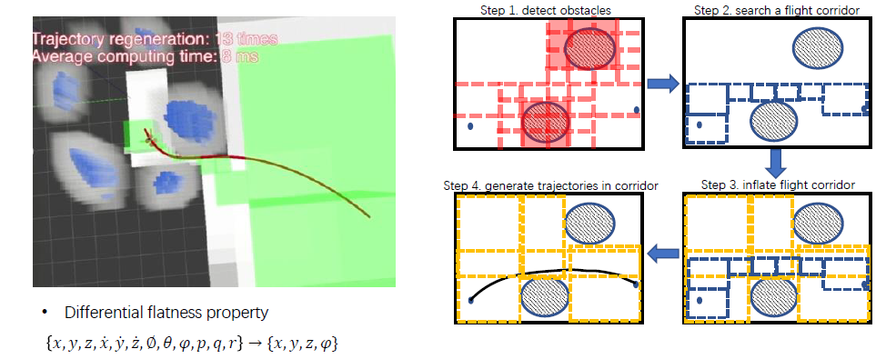
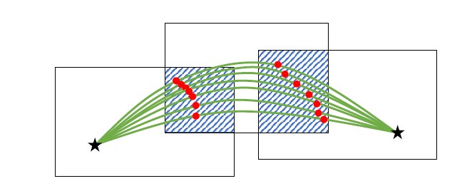
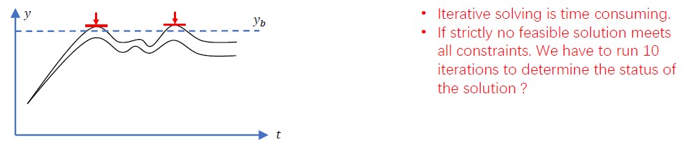
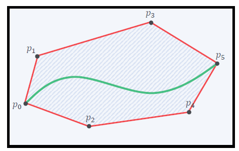
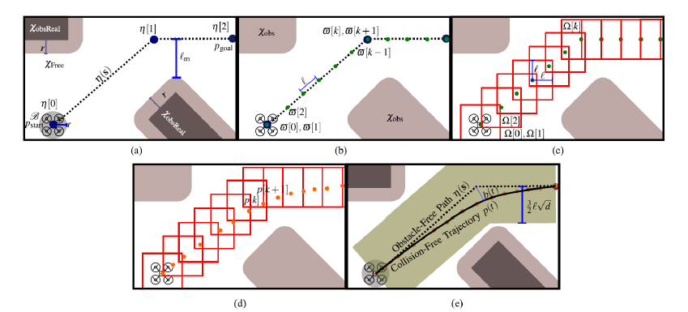

# Hard Constrained Trajectory Optimization
**Minimum snap**: good for smooth, not for collision avoidance
+ only constrain the intermediate waypoints
+ computational cheap and easy to implenmentation
+ no constraints on the trajectory itself
+ "overshoot" unavoidable

**Minimum snap with safety constraints:**
+ Adding forces (soft)
+ Adding bounds (hard)

## hard/soft constraints

**hard constraints:** The constraints are required to be strictly satisfied
$$
\begin{array}{ll}
\min & f(x) \\
\text { s.t. } & g_i(x)=c_i, \quad i=1, \cdots, n \quad \text { Equality constraints } \\
& h_j(x) \geq d_j, \quad j=1, \cdots, n \quad \text { Inequality constraints }
\end{array}
$$

**soft constraints:**
$$
\min  f(x)+\lambda_1\cdot g(x)+\lambda_2\cdot h(x)
$$
+ Penalty terms / loss functions
+ Constraints which are preferred but not strictly required
+ Various kind of loss function

## Corridor-based Trajectory Optimization

+ Cost function: $J=\sum_{\mu \in\{x, y, z\}} \int_0^T\left(\frac{d^k f_\mu(t)}{d t^k}\right)^2 d t$
+ Boundary constraints
+ Continiuty constraints
+ Safety constraints
+ $$\begin{array}{ll}\min & \mathbf{p}^T \mathbf{H p} \\\text { s.t. } & \mathbf{A}_{e q} \mathbf{p}=\mathbf{b}_{e q} \\& \mathbf{A}_{l q} \mathbf{p} \leq \mathbf{b}_{l q}\end{array}$$
**Instant linear constraints:**
+ start, goal constraint: $\mathbf{A}\mathbf{p}=\mathbf{b}$
+ transition point constraint: $\mathbf{A}\mathbf{p}=\mathbf{b},\mathbf{A}\mathbf{p}\leq\mathbf{b}$
+ continuity constraint: $\mathbf{A}\mathbf{p}_i=\mathbf{A}\mathbf{p}_{i+1}$

**Interval linear constraints:** (hard to implement, apporiximated by enforcing the intermediate points in the overlapping area)
+ boundary constraint: $\left(\mathbf{A}(t) \mathbf{p} \leq \mathbf{b}, \forall t \in\left[t_l, t_r\right]\right)$
+ dynamic constraint: $\left(\mathbf{A}(t) \mathbf{p} \leq \mathbf{b}, \forall t \in\left[t_l, t_r\right]\right)$
	+ velocity constraint
	+ acceleration constraint

**Advantages:**
+ Efficiency: path search in the reduced graph, convex optimization in the corridor are efficient
+ High quality: corridor provides large optimization freedom

**Problem**:  
All constraints are enforced on joints only, how to guarantee they are active along all trajectory?
+ Iteratively check extremum and add extra constraints.
+ Checking extremum is a polynomial root finding problem
	+ up to quadratic function, easy
	+ higher order, need numerical solution
+ Root finding using the MATLAB provided way:
	+ The general polynomial function has the companion matrix: $$A=\left[\begin{array}{ccccc}0 & 0 & \cdots & 0 & -a_0 \\1 & 0 & \cdots & 0 & -a_1 \\0 & 1 & \cdots & 0 & -a_2 \\\vdots & & \ddots & & \vdots \\0 & 0 & \cdots & 1 & -a_{n-1}\end{array}\right]$$
	+ The characteristic polynomial $det(xI-A)$ of $A$ is the polynomial $p(x)$.
	+ In other word, the eigen values of $A$ are the solutions.

## Bezier Curve Optimization

**Bezier Curve**:
+ Use **Bernstein** polynomial basis instead of monomial basis
+ Just a special polynomial, it can be mapped to monomial polynomial by $p=M\cdot c$, and all previous derivations still hold
$$
\begin{aligned}
&P_j(t)=p_j^0+p_j^1 t+p_j^2 t^2+\cdots+p_j^n t^n\\
&\begin{gathered}
B_j(t)=c_j^0 b_n^0(t)+c_j^1 b_n^1(t)+\cdots+c_j^n b_n^n(t)=\sum_{i=0}^n c_j^i b_n^i(t) \\
b_n^i(t)=\left(\begin{array}{l}
n \\
i
\end{array}\right) \cdot t^i \cdot(1-t)^{n-i}
\end{gathered}
\end{aligned}
$$

**Bezier Curve Properties:**
+ **Endpoint interpolation:** start at the first control point, end at the last control point, never pass any other control points.
+ **Convex hull:** entirely confined within the convex hull defined by all control points
+ **Hodograph**: The derivative curve $B'(t)$ is called as hodograph, and it is also a Bezier curve with control points $n\cdot(c_{i+1}-c_i)$, $n$ is the degree
+ **Fix time interval**: defined on $[0,1]$

**Using the convex hull property to formulate the interval constraints:**
+ Flight corridor consists of control points
+ Each cube corresponds to a piece of Bezier curve
+ Control points of this curve are enforced inside the polygon
+ The trajectory is entirely insdie the convex hull of all points
+ **The trajectory is inside the flight corridor**

**Problem Formulation:**
+ Higher order control points: $a_{\mu j}^{0, i}=c_{\mu j}^i, a_{\mu j}^{l, i}=\frac{n !}{(n-l) !} \cdot\left(a_{\mu j}^{l-1, i+1}-a_{\mu j}^{l-1, i}\right), \quad l \geq 1$
+ Boundary Constraints: $a_{\mu j}^{l, 0} \cdot s_j^{(1-l)}=d_{\mu j}^{(l)}$
+ Continuity Constraints: $a_{\mu j}^{\phi, n} \cdot s_j^{(1-\phi)}=a_{\mu, j+1}^{\phi, 0} \cdot s_{j+1}^{(1-\phi)}, \quad a_{\mu j}^{0, i}=c_{\mu j}^i .$
+ Safety Constraints: $\beta_{\mu j}^{-} \leq c_{\mu j}^i \leq \beta_{\mu j}^{+}, \quad \mu \in\{x, y, z\}, i=0,1,2, \ldots, n$
+ Dynamical Feasibility Constraints: $$\begin{aligned}& v_m^{-} \leq n \cdot\left(c_{\mu j}^i-c_{\mu j}^{i-1}\right) \leq v_m^{+} \\& a_m^{-} \leq n \cdot(n-1) \cdot\left(c_{\mu j}^i-2 c_{\mu j}^{i-1}+c_{\mu j}^{i-2}\right) / s_j \leq a_m^{+}\end{aligned}$$
Combine the constraints above:
$$
\begin{array}{ll}
\min & \mathbf{c}^T \mathbf{Q c} \\
\text { s.t. } & \mathbf{A}_{e q} \mathbf{c}=\mathbf{b}_{e q} \\
& \mathbf{A}_{l q} \mathbf{c} \leq \mathbf{b}_{l q} \\
& \mathbf{c}_j\in \Omega_j, j=1,2,\dots,m
\end{array}
$$

## Dense Constraints
+ Adding numerous constraints at discrete time ticks
+ Piecewise-constant accelerations at each tick
+ QP program solution

+ over-conservative
+ too many constraints, computation burden is high

## Mixed-Integer Optimization
***For quadrotor teams***

Assuming that an obstacle is a box, than the robot is collision-free if 
$$
\begin{aligned}
& \forall t_k: x_1\left(t_k\right)-x_2\left(t_k\right) \leq d_x \\
& \text { or } \quad x_2\left(t_k\right)-x_1\left(t_k\right) \leq d_x \\
& \text { or } \quad y_1\left(t_k\right)-y_2\left(t_k\right) \leq d_y \\
& \text { or } \quad y_2\left(t_k\right)-y_1\left(t_k\right) \leq d_y \\
& \text { or } \quad z_1\left(t_k\right)-z_2\left(t_k\right) \leq d_z \\
& \text { or } \quad z_2\left(t_k\right)-z_1\left(t_k\right) \leq d_z
\end{aligned}
$$
Formulate the above using Mixed-Integer and Big "M" method
$$
\begin{gathered}
\forall t_k: x_1\left(t_k\right)-x_2\left(t_k\right)-c_0 \cdot M \leq d_x \\
x_2\left(t_k\right)-x_1\left(t_k\right)-c_1 \cdot M \leq d_x \\
y_1\left(t_k\right)-y_2\left(t_k\right)-c_2 \cdot M \leq d_y \\
y_2\left(t_k\right)-y_1\left(t_k\right)-c_3 \cdot M \leq d_y \\
z_1\left(t_k\right)-z_2\left(t_k\right)-c_4 \cdot M \leq d_z \\
z_2\left(t_k\right)-z_1\left(t_k\right)-c_5 \cdot M \leq d_z \\
\sum_{i=0}^5 c_i=5, M=100000 \\
c_i \in\{0,1\}\\
\end{gathered}
$$
MIQP is super slow.

