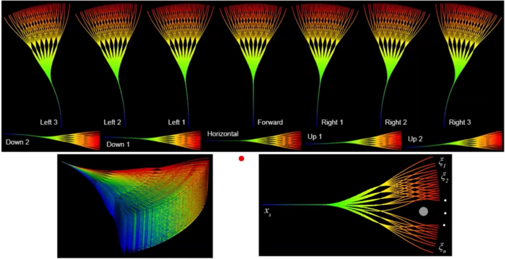
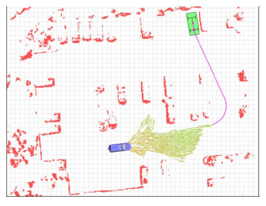

# Kinodynamic Path Finding
**Kinodynamic : Kinematic + Dynamic
+ Kinematic constraints: avoiding obstacle
+ Dynamic constrains: velocity, acceleration, force
+ **Differentially constrained**
+ **Up to force (acceleration)**

**Why kinodynamic planning?**
+ Coarse-to-fine
+ Trajectory only optimize locally
+ Infeasible path means nothing to nonholonomic system
+ 

**Unicycle drive model:**

$$
\left(\begin{array}{c}
\dot{x} \\
\dot{y} \\
\dot{\theta}
\end{array}\right)=\left(\begin{array}{c}
\cos \theta \\
\sin \theta \\
0
\end{array}\right) \cdot v+\left(\begin{array}{l}
0 \\
0 \\
1
\end{array}\right) \cdot \omega
$$
**Differential drive model:**

$$
\left(\begin{array}{c}
\dot{x} \\
\dot{y} \\
\dot{\theta}
\end{array}\right)=\left(\begin{array}{c}
\frac{r}{2}\left(\omega_l+\omega_r\right) \cos \theta \\
\frac{r}{2}\left(\omega_l+\omega_r\right) \sin \theta \\
\frac{r}{L}\left(\omega_r-\omega_l\right)
\end{array}\right)
$$

**Simplified car model:**

$$
\left(\begin{array}{c}
\dot{x} \\
\dot{y} \\
\dot{\theta}
\end{array}\right)=\left(\begin{array}{c}
v \cos \theta \\
v \sin \theta \\
\frac{v}{L} \tan \emptyset
\end{array}\right)
$$
+ Simple car model: $|v| \leq v_{\max }, \quad|\emptyset| \leq \emptyset_{\max }<\frac{\pi}{2}$
+ Reeds & Shepp's car: $v \in\left\{-v_{\max }, v_{\max }\right\}, \quad|\emptyset| \leq \emptyset_{\max }<\frac{\pi}{2}$
+ Dubin's car: $v =v_{\max }, \quad|\emptyset| \leq \emptyset_{\max }<\frac{\pi}{2}$

## State Lattice Planning

**Basic Idea:**
+ Require a graph with feasible motion connections
+ Create a graph with all edges executable
	+ **Forward:** discrete in control space
	+ **Reverse:** discrete in state space

For a robot model:
$$
\dot{s}=f(s, u)
$$
$s$ is the state, $u$ is the input.  
+ The robot is differentially driven
+ The initial state is $s_0$
+ Generate feasible local motion by:
	+ Select $u$, fix time $t$, forward simulate the system (numerical integration)
		+ Forward simulation
		+ Fixed $u$, $T$
		+ Easy to implement
		+ *No mission guidance*
		+ *Low planning efficiency*
	+ Select $s_f$, find the connection between $s_0$ and $s_f$
		+ Backward simulation
		+ Good mission guidence
		+ *Need calculate $u$, $T$*
		+ *Hard to implement*

### Sample in control space
For a UAV model:  
State: $\mathrm{s}=\left(\begin{array}{c}x \\ y \\ z \\ \dot{x} \\ \dot{y} \\ \dot{z}\end{array}\right) \quad$ Input: $u=\left(\begin{array}{c}\ddot{x} \\ \ddot{y} \\ \ddot{z}\end{array}\right)$,  
System equation: $\dot{s}=A \cdot s+B \cdot u$,  $A=\left[\begin{array}{llllll}0 & 0 & 0 & 1 & 0 & 0 \\0 & 0 & 0 & 0 & 1 & 0 \\0 & 0 & 0 & 0 & 0 & 1 \\0& 0 & 0 & 0 & 0 & 0 \\0 & 0 & 0 & 0 & 0 & 0 \\0 & 0 & 0 & 0 & 0 & 0\end{array}\right] \quad B=\left[\begin{array}{lll}0 & 0 & 0 \\0 & 0 & 0 \\0 & 0 & 0 \\1 & 0 & 0 \\0 & 1 & 0 \\0 & 0 & 1\end{array}\right]$  
+ Several-order integrator
+ $A$ is **nilpotent** (密邻矩阵): $\exists k>0, \forall i>k, A^i=0$

**State Transition:** $s(t)=e^{At}s_0+[\int_{0}^{t} e^{A(t-\sigma)}B d\sigma] u_m$  
+ Zero-input response $F(t)=e^{At}s_0$
+ Zero-state response $G(t)=[\int_{0}^{t} e^{A(t-\sigma)}B d\sigma] u_m$
+ $e^{AT}:$ state transition matrix, critical to integration
	+ $e^{A t}=I+\frac{A t}{1 !}+\frac{(A t)^2}{2 !}+\frac{(A t)^3}{3 !}+\cdots+\frac{(A t)^k}{k !}+\cdots$
	+ Since $A$ is nilpotent, if $A^n=0$, then $e^{At}$ has a closed-form expression in the form of an (n-1) degree matrix polynomial in $t$.

Sample example:

The lattice graph obtained by searching:

+ During searching, the graph can be built when necessary
+ Create nodes and connection when newly discovered
+ Save computation time/space

### Sample in state place

**Build the lattice graph for a Reeds-Shepp Car Model:**
+ Given an origin
+ for 8 neighbor nodes around the origin, feasible paths are found
+ extend outward to 24 neighbors
+ complete lattice

**Another example:**
+ Two layer lattice graph
+ Only first layer is different
+ Different initial states

**Comparison with control space:**
+ Sample in control space (no machine guidance) can result in infeasible motion
+ 
+ Sample in control space: Trajectories are denser in the direction of the initial angular velocity.
+ Sample in control space: Very similar outputs for several distinct inputs.
+ 

## Boundary Value Problem

**BVP** is the basis of state lattice planning.  

For example, design a trajectory $x(t)$ such that: $x(0)=a,x(T)=b$

+ 5th order polynomial: $x(t)=c_5t^5+c_4t^4+c_3t^3+c_2t^2+c_1t+c_0$
+ Solve:$$\left[\begin{array}{l}a \\b \\0 \\0 \\0 \\0\end{array}\right]=\left[\begin{array}{cccccc}0 & 0 & 0 & 0 & 0 & 1 \\T^5 & T^4 & T^3 & T^2 & T & 1 \\0 & 0 & 0 & 0 & 1 & 0 \\5 T^4 & 4 T^3 & 3 T^2 & 2 T & 1 & 0 \\0 & 0 & 0 & 2 & 0 & 0 \\20 T^3 & 12 T^2 & 6 T & 2 & 0 & 0\end{array}\right]\left[\begin{array}{l}c_5 \\c_4 \\c_3 \\c_2 \\c_1 \\c_0\end{array}\right]$$

## Optimal Boundary Value Problem (OBVP)
### Modelling
The objective is to minimize the integral of squared jerk:
$$
\begin{matrix}
J_\sum=\sum_{k=1}^3\limits J_k, \quad J_k=\frac{1}{T}\int_0^Tj_k(t)^2dt \\
\text{State: }s_k=(p_k,v_k,a_k) \quad \text{Input: }u_k=j_k \\ 
\text{System Model: }\dot{s}=f_s(s,u)=(v,a,j)
\end{matrix}
$$
### Pontryain's Minimum Principle
Generally, 
$$
J=h(s(T))+\int_0^T g(s(t),u(t))dt
$$
where $h(s(T))$ is the final state, $\int_0^T g(s(t),u(t))dt$ is the transition cost.  
Define the Hamilton function and costate:
$$
\begin{matrix} 
H(s,u,\lambda)=g(s,u)+\lambda^Tf_s(s,u) \\ 
\lambda=(\lambda_1,\lambda_2,\lambda_3) 
\end{matrix}
$$
Suppose $s^*$ is optimal state, $u^*$ is optimal input,  
$\dot{s}^*=f_s(s^*(t),u^*(t))$, given $s^*(0)=s(0)$,  
$\lambda(t)$ is the solution of:
$$
\dot{\lambda}(t)=-\nabla_sH(s^*(t),u^*(t),\lambda(t))
$$
with the boundary condition of: 
$$
\lambda(T)=-\nabla h(s^*(T))
$$
and the optimal control input is :
$$
u^*(t)=\arg \min _{u(t)} H\left(s^*(t), u(t), \lambda(t)\right)
$$
### Solving
Given $s_0$, $s_f$, Take the UAV model as example:
$$
\begin{aligned}
&J=h(s(T))+\int_0^T g(s(t),u(t))dt=\int_0^T \frac{1}{T}j(t)^2dt\\
&h(s(T))= \begin{cases}0, s(T)=s_f\\ \infty, s(T)\neq s_f\end{cases}\\
&g(s(t),u(t))=\frac{1}{T}u(t)^2=\frac{1}{T}j(t)^2
\end{aligned}
$$
First, introduce the costate (corresponding to $f_S$):
$$
\lambda=(\lambda_1,\lambda_2,\lambda_3)
$$
Define the Hamiltonian function:
$$
\begin{aligned}
H(s,u,\lambda)&=\frac{1}{T}j^2+\lambda^T f_s(s,u)\\
&=\frac{1}{T}j^2+\lambda_1v+\lambda_2a+\lambda_3j
\end{aligned}
$$
According to $\dot{\lambda}=-\nabla_s H(s^*,u^*,\lambda)$, 
$$
\begin{aligned}
&\nabla_s H(s,u,\lambda) = \left(\frac{\partial H}{\partial p},\frac{\partial H}{\partial v},\frac{\partial H}{\partial a}\right)=\left(0,\lambda_1,\lambda_2\right)\\
&\dot{\lambda}=-\nabla_s H(s^*,u^*,\lambda)=(0,-\lambda_1,-\lambda_2)
\end{aligned}
$$
Solving $\dot{\lambda}=(0,\lambda_1,\lambda_2)$, we can obtain
$$
\begin{cases} 
\lambda_1=\alpha\\
\lambda_2=-\alpha t+\beta\\
\lambda_3=\frac{1}{2}\alpha^2t-\beta t+\gamma \\
\end{cases}
$$
which can also be formulated to simplify the next  calculation:
$$
\lambda(t)=\frac{1}{T}\begin{bmatrix}-2\alpha\\2\alpha t+2\beta\\-\alpha t^2-2\beta t-2\gamma\end{bmatrix}
$$
According to $u^*=j^*=\arg \min_j H(s^*,j,\lambda)$,
$$
\begin{aligned}
&H(s^*,j,\lambda)=\frac{1}{T}j^2+\lambda_1 v^*+\lambda_2 a^* +\lambda_3 j\\
&\frac{\partial H(s^*,j,\lambda)}{\partial j}=\frac{2}{T}j+\lambda_3=0\\
&j=-\frac{T}{2}\lambda_3
\end{aligned}
$$
Finally obtain
$$
u^*=j^*=\frac{1}{2}\alpha t^2+\beta t+\gamma
$$
Integrate $u^*$, consider the initial state $s_0=(p_0,v_0,a_0)$
$$
s^*(t)=\left[\begin{array}{c}
\frac{\alpha}{120} t^5+\frac{\beta}{24} t^4+\frac{\gamma}{6} t^3+\frac{a_0}{2} t^2+v_0 t+p_0 \\
\frac{\alpha}{24} t^4+\frac{\beta}{6} t^3+\frac{\gamma}{2} t^2+a_0 t+v_0 \\
\frac{\alpha}{6} t^3+\frac{\beta}{2} t^2+\gamma t+a_0
\end{array}\right]
$$
given $s_f=s(T)=(p_f,v_f,a_f)$,
$$
\begin{aligned}
& {\left[\begin{array}{ccc}
\frac{1}{120} T^5 & \frac{1}{24} T^4 & \frac{1}{6} T^3 \\
\frac{1}{24} T^4 & \frac{1}{6} T^3 & \frac{1}{2} T^2 \\
\frac{1}{6} T^3 & \frac{1}{2} T^2 & T
\end{array}\right]\left[\begin{array}{c}
\alpha \\
\beta \\
\gamma
\end{array}\right]=\left[\begin{array}{c}
\Delta p \\
\Delta v \\
\Delta a
\end{array}\right]} \\
& {\left[\begin{array}{c}
\Delta p \\
\Delta v \\
\Delta a
\end{array}\right]=\left[\begin{array}{c}
p_f-p_0-v_0 T-\frac{1}{2} a_0 T^2 \\
v_f-v_0-a_0 T \\
a_f-a_0
\end{array}\right]}
\end{aligned}
$$
solving
$$
\left[\begin{array}{l}
\alpha \\
\beta \\
\gamma
\end{array}\right]=\frac{1}{T^5}\left[\begin{array}{ccc}
720 & -360 T & 60 T^2 \\
-360 T & 168 T^2 & -24 T^3 \\
60 T^2 & -24 T^3 & 3 T^4
\end{array}\right]\left[\begin{array}{c}
\Delta p \\
\Delta v \\
\Delta a
\end{array}\right]
$$
The final optimal cost is $\int_0^T\frac{1}{T}{j^*}^2$ 
$$
J=\gamma^2+\beta \gamma T+\frac{1}{3} \beta^2 T^2+\frac{1}{3} \alpha \gamma T^2+\frac{1}{4} \alpha \beta T^3+\frac{1}{20} \alpha^2 T^4
$$
$J$ only depends on $T$, and the boundary states (known), so we can even get an optimal $T$ through polynomial function root finding problem.

**For fixed final state problem (discussed above),**
$$
h(s(T))= \begin{cases}0, s(T)=s_f\\ \infty, otherwise\end{cases}
$$
is not differential, so we discard the condition, use given $x(T)$ to solve for unknown variables.

**For (partially)-free final state problem,** given $s_i(T),i\in I$,  
we have boundary condition for other costate:
$$
\lambda_j(T)=\frac{\partial h(s^*(T))}{\partial s_j}, j\neq i
$$
## Graph search problem
After building the **lattice graph**, the problem become a graph search problem.  

## Trajectory Library
+ Single layer lattice planning, common for local collision avoidance
+ No graph search, only trajectory selection
+ Rating each trajectory based on a multi-term cost function
+ 

## Heuristic Design
Principle: solve an easier problem
+ Assume no obstacle existence: solve OBVP 
+ Assume no dynamic existence: search the shortest path

## Planning in Frenet-serret Frame
### Frenet-serret Frame:
+ dynamic reference frame
+ lateral and longitudinal independently
+ For lane following problem, the problem is decoupled
+ Motion parametrization:
	+ $$\begin{aligned}& d(t)=a_{d 0}+a_{d 1} t+a_{d 2} t^2+a_{d 3} t^3+a_{d 4} t^4+a_{d 5} t^5 \\& s(t)=a_{s 0}+a_{s 1} t+a_{s 2} t^2+a_{s 3} t^3+a_{s 4} t^4+a_{s 5} t^5\end{aligned}$$
	+ Solve the optimal control problem

## Hybrid A*

Basic idea:
+ Online generate dense lattice is time-consuming
+ Prune nodes: use grid map

### Algorithm

### Heuristic design
+ 2D Euclidean distance
+ non-holonomic-without-obstacles (bad performance in some cases)
+ non-holonomic-without-obstacles + holonomic-with-obstacles (2D shortest path)

### Other tricks
**Analytic Expansions:** one shot  heuristic, add a state-driven bias  towards the searching process.  
During the planning, randomly try connecting the cur nodes to the goal using OBVP.

## Kinodynamic RRT*
### Algorithm

### Sample
Instead of sampling in Euclidean space, **sample in full state space.**  
The LTI system state-space equation:
$$
\dot{x(t)}=Ax(t)+Bu(t)+c
$$
For example, the double integrator system
$$
x=\left[\begin{array}{l}
p \\
v
\end{array}\right], A=\left[\begin{array}{ll}
0 & I \\
0 & 0
\end{array}\right], B=\left[\begin{array}{l}
0 \\
I
\end{array}\right]
$$
### Near
If without motion constraints, Euclidean or Manhattan distance can be used.  
In state space, **bring in optimal control.**

If bring optimal control, define cost function.  
Typically, a quadratic form of time-energy optimal is adopted.
$$
c[\tau]=\int_0^\tau\left(1+u(t)^T R u(t)\right) d t
$$
Two states are near if the cost is small.

#### Fixed final state, fixed final time
The optimal control $u^*(t)$
$$
u^*(t)=R^{-1} B^T \exp \left[A^T(\tau-t)\right] G(\tau)^{-1}\left[x_1-\bar{x}(\tau)\right] .
$$
$G(t)$ is the weighted controllability Gramian:
$$
G(t)=\int_0^t exp(A(t-t'))BR^{-1}B^Texp[A^T(t-t')]dt'
$$
which is the solution to the Lyapunov equation:
$$
\dot{G}(t)=A G(t)+G(t) A^T+B R^{-1} B^T, G(0)=0 .
$$
$\bar{x}(t)$ describe what the state $x$ would be at time $t$ if no control input:
$$
\bar{x}(t)=exp(At)x_0+\int_0^t exp[A(t-t')]cdt'
$$
which is the solution to the differential equation
$$
\dot{\bar{x}}(t)=A \bar{x}(t)+c, \bar{x}(0)=x_0
$$
#### Fixed final state, free final time
If we want to find the optimal arrive time $\tau$, fill in the $u^*(t)$ into the cost function
$$
c[\tau]=\tau+\left[x_1-\bar{x}(\tau)\right]^T G(t)^{-1}\left[x_1-\bar{x}(\tau)\right] .
$$
The optimal $\tau$ can be found by taking the derivative of $c[\tau]$ with respect to $\tau$
$$
\dot{c}[\tau]=1-2\left(A x_1+c\right)^T d(\tau)-d(\tau)^T B R^{-1} B^T d(\tau)
$$
where
$$
d(\tau)=G(t)^{-1}\left[x_1-\bar{x}(\tau)\right] .
$$
Solve $\dot{c}[\tau]=0$ for $\tau^*$.  
The function $c[\tau]$ may have multiple local minima, for a double integrator system, it's a 4th order polynomial.

## Appendix
### Solving OBVP for partially-free final state
$s_0$, $p_f$ is given, $v_f$ and $a_f$ is free:
$$
\begin{aligned}
&J=h(s(T))+\int_0^T g(s(t),u(t))dt=\int_0^T \frac{1}{T}j(t)^2dt\\
&h(s(T))= 0\\
&g(s(t),u(t))=\frac{1}{T}u(t)^2=\frac{1}{T}j(t)^2
\end{aligned}
$$
Introduce the costate:
$$
\lambda=(\lambda_1,\lambda_2,\lambda_3)
$$
Define the Hamiltonian function:
$$
\begin{aligned}
H(s,u,\lambda)&=\frac{1}{T}j^2+\lambda^T f_s(s,u)\\
&=\frac{1}{T}j^2+\lambda_1v+\lambda_2a+\lambda_3j
\end{aligned}
$$
According to $\dot{\lambda}=-\nabla_s H(s^*,u^*,\lambda)$, 
$$
\begin{aligned}
&\nabla_s H(s,u,\lambda) = \left(\frac{\partial H}{\partial p},\frac{\partial H}{\partial v},\frac{\partial H}{\partial a}\right)=\left(0,\lambda_1,\lambda_2\right)\\
&\dot{\lambda}=-\nabla_s H(s^*,u^*,\lambda)=(0,-\lambda_1,-\lambda_2)
\end{aligned}
$$
For the free final state, 
$$
\begin{aligned}
\lambda_{2,3}(T)&=-\nabla_{s_v,s_a} h(s^*(T))\\
\lambda_2(T)&=-\frac{\partial h}{\partial v(T)}(s^*(T))=0\\
\lambda_3(T)&=-\frac{\partial h}{\partial a(T)}(s^*(T))=0\\
\end{aligned}
$$
Then we can get
$$
\lambda(t)=\frac{1}{T}\left[\begin{array}{c}
-2 \alpha \\
2 \alpha(t-T) \\
-\alpha(t-T)^2
\end{array}\right]
$$
According to $u^*=j^*=\arg \min_j H(s^*,j,\lambda)$,
$$
\begin{aligned}
&H(s^*,j,\lambda)=\frac{1}{T}j^2+\lambda_1 v^*+\lambda_2 a^* +\lambda_3 j\\
&\frac{\partial H(s^*,j,\lambda)}{\partial j}=\frac{2}{T}j+\lambda_3=0\\
&j=-\frac{T}{2}\lambda_3
\end{aligned}
$$
Finally obtain
$$
u^*=j^*=\frac{\alpha}{2}(t-T)^2
$$
Integrate $u^*$, consider the initial state $s_0=(p_0,v_0,a_0)$
$$
s^*(t)=\left[\begin{array}{c}
\frac{\alpha}{120}(t-T)^5+\frac{1}{2}\left(a_0+\frac{\alpha}{6} T^3\right) t^2+\left(v_0-\frac{\alpha}{24} T^4\right) t+\left(p_0+\frac{\alpha}{120} T^5\right) \\
\frac{\alpha}{24}(t-T)^4+\left(a_0+\frac{\alpha}{6} T^3\right) t+\left(v_0-\frac{\alpha}{24} T^4\right) \\
\frac{\alpha}{6}(t-T)^3+\left(a_0+\frac{\alpha}{6} T^3\right)
\end{array}\right]
$$
given $p(T)=p_f$,
$$
\begin{aligned}
p_f&=\frac{1}{2}\left(a_0+\frac{\alpha}{6} T^3\right) T^2+\left(v_0-\frac{\alpha}{24} T^4\right) T+\left(p_0+\frac{\alpha}{120} T^5\right)\\
\Delta p&=p_f-p_0-v_0T-\frac{a_0}{2}T^2
\end{aligned}
$$
solving
$$
\alpha=\frac{20\Delta p}{T^5}
$$
The final optimal cost is 
$$
J=\int_0^T \frac{1}{T} j^*(t)^2 d t=\int_0^T \frac{1}{T}\left(\frac{10 \Delta p}{T^5}(t-T)\right)^2 d t
$$

### Example for a Linear Modeled Robot
The system model:
$$
x=\left(\begin{array}{l}
p_x \\
p_y \\
p_z \\
v_x \\
v_y \\
v_z
\end{array}\right), u=\left(\begin{array}{l}
a_x \\
a_y \\
a_z
\end{array}\right), \dot{x}=f(x, u)=\left(\begin{array}{l}
v_x \\
v_y \\
v_z \\
a_x \\
a_y \\
a_z
\end{array}\right)
$$
#### Control Sample (Forward Integration)
The system equation:
$$
\dot{x}=Ax+Bu,\quad A=\begin{bmatrix}0 & 0 & 0 & 1 & 0 & 0\\0 & 0 & 0 & 0 & 1 & 0\\0 & 0 & 0 & 0 & 0 & 1\\0 & 0 & 0 & 0 & 0 & 0\\0 & 0 & 0 & 0 & 0 & 0\\0 & 0 & 0 & 0 & 0 & 0\end{bmatrix},\quad B=\begin{bmatrix}0 & 0 & 0 \\0 & 0 & 0  \\0 & 0 & 0 \\1 & 0 & 0 \\0 & 1 & 0 \\0 & 0 & 1 \end{bmatrix}
$$
According to 
$$
e^{A t}=I+\frac{A t}{1 !}+\frac{(A t)^2}{2 !}+\frac{(A t)^3}{3 !}+\cdots+\frac{(A t)^k}{k !}+\cdots
$$
and $A$ is nilpotent, $\forall k\geq 2,A^k=0$, so we can get
$$
e^{At}=I+At=\begin{bmatrix}1 & 0 & 0 & t & 0 & 0\\0 & 1 & 0 & 0 & t & 0\\0 & 0 & 1& 0 & 0 & t\\0 & 0 & 0 & 1 & 0 & 0\\0 & 0 & 0 & 0 & 1 & 0\\0 & 0 & 0 & 0 & 0 & 1\end{bmatrix}
$$
Based on the $s(t)=e^{At}s_0+[\int_{0}^{t} e^{A(t-\sigma)}B d\sigma] u_m$, 
$$
s(t)=\begin{bmatrix}p_{x_0}+v_{x_0}t+\frac{a_x}{2}t^2\\p_{y_0}+v_{y_0}t+\frac{a_y}{2}t^2\\p_{z_0}+v_{z_0}t+\frac{a_z}{2}t^2\\v_{x_0}+a_xt\\v_{y_0}+a_yt\\v_{z_0}+a_zt\\\end{bmatrix}
$$
#### State Sample (OBVP)
Objective:
$$
J=\int_0^T g(x, u) d t=\int_0^T\left(1+u^T R u\right) d t=\int_0^T\left(1+a_x^2+a_y^2+a_z^2\right) d t
$$
Introduce the costate:
$$
\lambda=(\lambda_1,\lambda_2,\lambda_3,\lambda_4,\lambda_5,\lambda_6)
$$
Define the Hamiltonian function:
$$
\begin{aligned}
H(x,u,\lambda)&=\left(1+a_x^2+a_y^2+a_z^2\right)+\lambda_1v_x+\lambda_2v_y+\lambda_3v_z+\lambda_1a_x+\lambda_2a_y+\lambda_3a_z
\end{aligned}

$$
According to $\dot{\lambda}=-\nabla_s H(s^*,u^*,\lambda)$, 
$$
\begin{aligned}
&\nabla_x H(x,u,\lambda) =\left(0,0,0,\lambda_1,\lambda_2,\lambda_3\right)\\
&\dot{\lambda}=-\nabla_s H(x^*,u^*,\lambda)=\left(0,0,0,-\lambda_1,-\lambda_2,-\lambda_3\right)
\end{aligned}
$$
Solving
$$
\lambda=\left(\begin{array}{c}
2 \alpha_1 \\
2 \alpha_2 \\
2 \alpha_3 \\
-2 \alpha_1 t-2 \beta_1 \\
-2 \alpha_2 t-2 \beta_2 \\
-2 \alpha_3 t-2 \beta_3
\end{array}\right)
$$
For $u^*=\arg \min_u H(x^*,u,\lambda)$,
$$
\begin{aligned}
\frac{\partial H(x^*,u,\lambda)}{\partial u}&=\left(2a_x+\lambda_4,2a_y+\lambda_5,2a_z+\lambda_6\right)\\
u^*&=\left(-\frac{1}{2}\lambda_4, -\frac{1}{2}\lambda_5,-\frac{1}{2}\lambda_6\right)\\
&=\left(\alpha_1t+\beta_1,\alpha_2t+\beta_2,\alpha_3t+\beta_3\right)
\end{aligned}
$$
Then we can integrate $u^*$ to get 
$$
x^*=\left(\begin{array}{c}
\frac{1}{6} \alpha_1 t^3+\frac{1}{2} \beta_1 t^2+v_{x 0} t+p_{x 0} \\
\frac{1}{6} \alpha_2 t^3+\frac{1}{2} \beta_2 t^2+v_{y 0} t+p_{y 0} \\
\frac{1}{6} \alpha_3 t^3+\frac{1}{2} \beta_3 t^2+v_{z 0} t+p_{z 0} \\
\frac{1}{2} \alpha_1 t^2+\beta_1 t+v_{x 0} \\
\frac{1}{2} \alpha_2 t^2+\beta_2 t+v_{y 0} \\
\frac{1}{2} \alpha_3 t^2+\beta_3 t+v_{z 0}
\end{array}\right)
$$
Considering the initial and final state, $\alpha,\beta,\gamma$ are solved as
$$
\begin{matrix}
\left(\begin{array}{cccccc}
\frac{1}{6} T^3 & 0 & 0 & \frac{1}{2} T^2 & 0 & 0 \\
0 & \frac{1}{6} T^3 & 0 & 0 & \frac{1}{2} T^2 & 0 \\
0 & 0 & \frac{1}{6} T^3 & 0 & 0 & \frac{1}{2} T^2 \\
\frac{1}{2} T^2 & 0 & 0 & T & 0 & 0 \\
0 & \frac{1}{2} T^2 & 0 & 0 & T & 0 \\
0 & 0 & \frac{1}{2} T^2 & 0 & 0 & T
\end{array}\right)\left(\begin{array}{l}
\alpha_1 \\
\alpha_2 \\
\alpha_3 \\
\beta_1 \\
\beta_2 \\
\beta_3
\end{array}\right)=\left(\begin{array}{l}
\Delta p_x \\
\Delta p_y \\
\Delta p_z \\
\Delta v_x \\
\Delta v_y \\
\Delta v_z
\end{array}\right)\\
\left(\begin{array}{c}
\Delta p_x \\
\Delta p_y \\
\Delta p_z \\
\Delta v_x \\
\Delta v_y \\
\Delta v_z
\end{array}\right)=\left(\begin{array}{c}
p_{x f}-v_{x 0} T-p_{x 0} \\
p_{y f}-v_{y 0} T-p_{y 0} \\
p_{z f}-v_{x 0} T-p_{z 0} \\
v_{x f}-v_{x 0} \\
v_{y f}-v_{y 0} \\
v_{z f}-v_{z 0}
\end{array}\right)\\
\left(\begin{array}{l}
\alpha_1 \\
\alpha_2 \\
\alpha_3 \\
\beta_1 \\
\beta_2 \\
\beta_3
\end{array}\right)=\left(\begin{array}{cccccc}
-\frac{12}{T^3} & 0 & 0 & \frac{6}{T^2} & 0 & 0 \\
0 & -\frac{12}{T^3} & 0 & 0 & \frac{6}{T^2} & 0 \\
0 & 0 & -\frac{12}{T^3} & 0 & 0 & \frac{6}{T^2} \\
\frac{6}{T^2} & 0 & 0 & -\frac{2}{T} & 0 & 0 \\
0 & \frac{6}{T^2} & 0 & 0 & -\frac{2}{T} & 0 \\
0 & 0 & \frac{6}{T^2} & 0 & 0 & -\frac{2}{T}
\end{array}\right)\left(\begin{array}{c}
\Delta p_x \\
\Delta p_y \\
\Delta p_z \\
\Delta v_x \\
\Delta v_y \\
\Delta v_z
\end{array}\right)
\end{matrix}
$$
The cost
$$
\begin{aligned}
J&=\int_0^T\left(1+a_x^2+a_y^2+a_z^2\right) d t\\
&=T+\left(\frac{1}{3} \alpha_1{ }^2 T^3+\alpha_1 \beta_1 T^2+\beta_1{ }^2 T\right)+\left(\frac{1}{3} \alpha_2{ }^2 T^3+\alpha_2 \beta_2 T^2+\beta_2{ }^2 T\right)\\
&+\left(\frac{1}{3} \alpha_3{ }^2 T^3+\alpha_3 \beta_3 T^2+\beta_3{ }^2 T\right)\\
&=\frac{12 (-p_{x_0}+p_{x_f}-T v_{x_0})^2}{T^3}-\frac{12 (v_{x_f}-v_{x_0}) (-p_{x_0}+p_{x_f}-T v_{x_0})}{T^2}\\
&+\frac{12 (-p_{y_0}+p_{y_f}-T v_{y_0})^2}{T^3}-\frac{12 (v_{y_f}-v_{y_0}) (-p_{y_0}+p_{y_f}-T v_{y_0})}{T^2}\\
&+\frac{12 (-p_{z_0}+p_{z_f}-T v_{z_0})^2}{T^3}-\frac{12 (v_{z_f}-v_{z_0}) (-p_{z_0}+p_{z_f}-T v_{z_0})}{T^2}\\
&+\frac{4 (v_{x_f}-v_{x_0})^2}{T}+\frac{4 (v_{y_f}-v_{y_0})^2}{T}+\frac{4 (v_{z_f}-v_{z_0})^2}{T}+T
\end{aligned}

$$
To minimize $J$, solve the derivative of $J$ with respect to $T$, given $v_f=0$
$$
\begin{aligned}
\frac{dJ}{dT}=&-\frac{36 \left((p_{x_f}-p_{x_0})^2+(p_{y_f}-p_{y_0})^2+(p_{z_f}-p_{z_0})^2\right)}{T^4}\\
&+\frac{24 ((p_{x_f}-p_{x_0})v_{x_0}+(p_{y_f}-p_{y_0})v_{y_0}+(p_{z_f}-p_{z_0})v_{z_0})}{T^3}\\
&-\frac{4 \left(v_{x_0}^2+v_{y_0}^2+v_{z_0}^2\right)}{T^2}+1\\
\frac{dJ}{dT}&=0
\end{aligned}
$$
Solve the zero point of the polynomial to obtain $T$, then the optimal $J$ is output. 