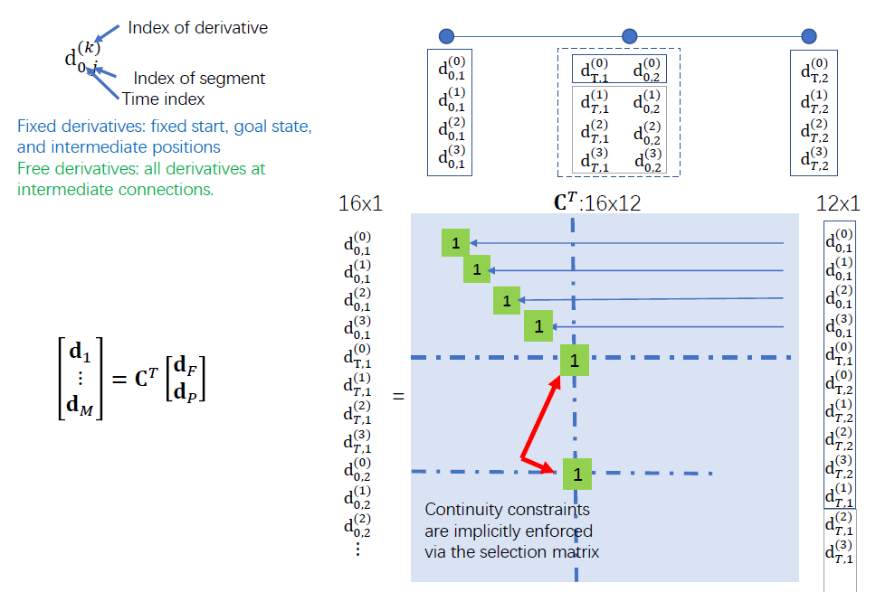
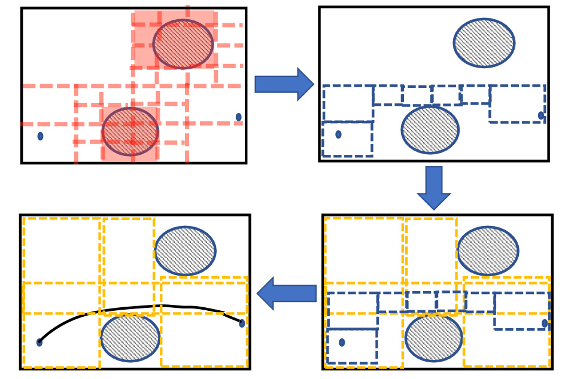

# Minimum Snap Trajectory Generation

**Why smooth trajectory:**
+ Good for autonomous moving
+ Velocity/higher order dynamics can't change immediately
+ The robot should not stop at turns
+ Save energy

**Why trajectory generation/optimizaton:**
+ Path quality
+ Time efficiency 

## Smooth trajectory generation
+ Boundary condition: start, goal position (orientations)
+ Intermediate condition: waypoint positions (orientations)
	+ found by path finding
+ Smoothness criteria
	+ minimizing rate of change of "input"

## Differential Flatness
The states and inputs of a quadrotor can be written as **algebraic functions** of **four carefully selected flat outputs and their derivatives.**
+ Any smooth trajectory in the space of flat outputs (with reasonably bounded derivatives) can be followed by the under-actuated quadrotor (geometric control)
+ A possible choice: $\sigma=[x,y,z,\psi]^T$
+ Trajectory in the space of flat outputs: $\sigma(t)=[T_0,T_M]\rightarrow \mathbb{R}^3\times SO(2)$ 

**Quadrotor states:** 
$$
\mathbf{X}=\left[x, y, z, \phi, \theta, \psi, \dot{x}, \dot{y}, \dot{z}, \omega_x, \omega_y, \omega_z\right]^T
$$
**Nonlinear dynamics:**
+ Newtow Equation: 
$$
\begin{aligned}
&m \ddot{\boldsymbol{p}}=\left[\begin{array}{c}0 \\0 \\-m g\end{array}\right]+\boldsymbol{R}\left[\begin{array}{c}0 \\0 \\F_1+F_2+F_3+F_4\end{array}\right]=\left[\begin{array}{c}0 \\0 \\-m g\end{array}\right]+\boldsymbol{R}\left[\begin{array}{c}0\\0\\u_1\end{array}\right]\\
&m \ddot{\boldsymbol{p}}=-m g \mathbf{z}_W+u_1 \mathbf{z}_B
\end{aligned}
$$
+ Euler Equation: 
$$
\begin{aligned}
&\boldsymbol{I} \cdot\left[\begin{array}{c}\dot{\omega}_x \\\dot{\omega}_y \\\dot{\omega}_z\end{array}\right]+\left[\begin{array}{c}\omega_x \\\omega_y \\\omega_z\end{array}\right] \times \boldsymbol{I} \cdot\left[\begin{array}{c}\omega_x \\\omega_y \\\omega_z\end{array}\right]=\left[\begin{array}{c}l\left(F_2-F_4\right) \\l\left(F_3-F_1\right) \\M_1-M_2+M_3-M_4\end{array}\right]=\left[\begin{array}{c}u_2\\u_3\\u_4\end{array}\right]\\
&\boldsymbol{\omega}_B=\left[\begin{array}{l}
\omega_x \\
\omega_y \\
\omega_z
\end{array}\right], \quad \boldsymbol{\dot{\omega}}_B=\boldsymbol{I}^{-1}\left[-\boldsymbol{\omega}_B \times \boldsymbol{I} \cdot \boldsymbol{\omega}_B+\left[\begin{array}{l}
u_2 \\
u_3 \\
u_4
\end{array}\right]\right]
\end{aligned}
$$
Choose the **flat output** $\sigma=[x,y,z,\psi]^T$,

**Orientaion:**
+ From the equation of motion: $$\mathbf{z}_B=\frac{\mathbf{t}}{\|\mathbf{t}\|}, \mathbf{t}=\left[\ddot{\boldsymbol{\sigma}}_1, \ddot{\boldsymbol{\sigma}}_2, \ddot{\boldsymbol{\sigma}}_3+g\right]^T$$
+ Define the yaw vector (Z-X-Y Euler):$$\mathbf{x}_C=\left[\cos \boldsymbol{\sigma}_4, \sin \boldsymbol{\sigma}_4, 0\right]^T$$
+ Orientation can be expressed:$$\mathbf{y}_B=\frac{\mathbf{z}_B \times \mathbf{x}_C}{\left\|\mathbf{z}_B \times \mathbf{x}_C\right\|}, \quad \mathbf{x}_B=\mathbf{y}_B \times \mathbf{z}_B \quad \boldsymbol{R}_B=\left[\begin{array}{lll}\mathbf{x}_B & \mathbf{y}_B & \mathbf{z}_B\end{array}\right]$$
**Angular Velocity:**
+ Take the derivative of the motion equation:$$m \ddot{\boldsymbol{p}}=-m g \mathbf{z}_W+u_1 \mathbf{z}_B . \quad \longrightarrow \quad m \dot{\boldsymbol{a}}=\dot{u}_1 \mathbf{z}_B+\boldsymbol{\omega}_{B W} \times u_1 \mathbf{z}_B$$The $\omega_{BW}$ is the body angular velocity viewed in the world frame.
+ vertical thrust: $\dot{u}_1=\mathbf{z}_B \cdot m \dot{\boldsymbol{a}}$
+ we have:$$\mathbf{h}_\omega=\boldsymbol{\omega}_{B W} \times \mathbf{z}_B=\frac{m}{u_1}\left(\dot{\boldsymbol{a}}-\left(\mathbf{z}_B \cdot \dot{\boldsymbol{a}}\right) \mathbf{z}_B\right) .$$
+ we know that $\boldsymbol{\omega}_{B W}=\omega_x \mathbf{x}_B+\omega_y \mathbf{y}_B+\omega_z \mathbf{z}_B$, then $$\begin{aligned}\boldsymbol{\omega}_{B W}\times\mathbf{z}_B&=\omega_x\mathbf{x}_B\times\mathbf{z}_B+\omega_y\mathbf{y}_B\times\mathbf{z}_B+\omega_z\mathbf{z}_B\times\mathbf{z}_B \\ \mathbf{h}_\omega&=-\omega_x\mathbf{y}_B+\omega_y\mathbf{x}_B\end{aligned}$$
+ Multiply both sides by $\mathbf{x}_B$ or $\mathbf{y}_B$, the angular velocitys can be found:$$\omega_x=-\mathbf{h}_\omega \cdot \mathbf{y}_B, \quad \omega_y=\mathbf{h}_\omega \cdot \mathbf{x}_B$$
+ Since $\boldsymbol{\omega}_{B W}=\boldsymbol{\omega}_{B C}+\boldsymbol{\omega}_{C W}$, $\boldsymbol{\omega}_{B C}$ has no $\mathbf{z}_B$ component, $$\omega_z=\boldsymbol{\omega}_{B W} \cdot \mathbf{z}_B=\boldsymbol{\omega}_{C W} \cdot \mathbf{z}_B=\dot{\psi} \mathbf{z}_W \cdot \mathbf{z}_B$$
**Planning-control loop:**

 

## Polynomial Trajectories
+ Flat outputs: $\sigma=[x,y,z,\psi]^T$
+ Trajectory in the space of flat outputs: $\sigma(t)=[T_0,T_M]\rightarrow \mathbb{R}^3\times SO(2)$ 
+ Polynomial function used to specify trajectories in the space of outputs:
	+ Easy determination of smoothness criterion with polynomial orders
	+ Easy and closed form calculation of derivatives
	+ Decoupled trajectory generation in three dimensions

## Optimization-based Trajectory Generation
+ Minimize Jerk: minimize angualr velocity, good for visual tracking
+ Minimize Snap: minimize differential thrust, save energy

Multi-segment Formulation:
$$
 f(t)=\left\{\begin{array}{cc}
f_1(t) \doteq \sum_{i=0}^N p_{1, i} t^i & T_0 \leq t \leq T_1 \\
f_2(t) \doteq \sum_{i=0}^N p_{2, i} t^i & T_1 \leq t \leq T_2 \\
\vdots & \vdots \\
f_M(t) \doteq \sum_{i=0}^N p_{M, i} t^i & T_{M-1} \leq t \leq T_M
\end{array}\right.
$$
+ Each is polynomial
+ No need to fix the order, but keep it same make the problem easier
+ Time duration must be known
+ Derivative constraints: $\left\{\begin{aligned} f_0^{(k)}\left(T_{0}\right) & =x_{0}^{(k)} \\ f_N^{(k)}\left(T_N\right) & =x_{T}^{(k)}\end{aligned}\right.$
+ Continuity constraints: $f_{j}^{(k)}(T_j)=f_{j+1}^{(k)}(T_j)$

Determine the trajectory order:
+ Ensure smooth at an order
+ Ensure continuity at an order
+ Minimize control input at an order

Minimum degree polynomial to ensure smoothness for one-segment trajectory:
+ Minimum jerk ( $p,v,a$ at boundary is fixed): $N=2*3(jerk)-1=5$
+ Minimum snap ($p,v,a,j$ at boundary is fixed): $N=2*4(snap)-1=7$

Minimum degree polynomial to ensure smoothness for k-segment trajectory:
+ Minimum jerk ($p,v,a$ fixed at start and goal, $p$ fixed in intermidiate point): 
	+ Constrain nums: $3+3+(k-1)=k+5$
	+ Unknown nums: $(N+1)*k$
	+ $(N+1)*k=k+5,N=\frac{5}{k}$

Timeline:
+ Many relative timeline: Numerical stable
+ One common timeline: Mathematical clear

## Minimum Snap Trajectory Generation

**Cost function for one segment:**
$$
\begin{aligned}
& f(t)=\sum_i p_i t^i \\
& \Rightarrow f^{(4)}(t)=\sum_{i \geq 4} i(i-1)(i-2)(i-3) t^{i-4} p_i \\
& \Rightarrow\left(f^{(4)}(t)\right)^2=\sum_{i \geq 4, l \geq 4} i(i-1)(i-2)(i-3) l(l-1)(l-2)(l-3) t^{i+l-8} p_i p_l \\
& \Rightarrow J(T)=\int_{T_{j-1}}^{T_j}\left(f^4(t)\right)^2 d t=\sum_{i \geq 4, l \geq 4} \frac{i(i-1)(i-2)(i-3) j(l-1)(l-2)(l-3)}{i+l-7}\left(T_j^{i+l-7}-T_{j-1}^{i+l-7}\right) p_i p_l\\
& \Rightarrow J(T)=\sum_{i \geq 4, l \geq 4}q_{il}p_ip_l
\end{aligned}
$$
which is a **Quadratic form:**
$$
\begin{aligned}
J_j(T)&=
\begin{bmatrix}\vdots\\p_i\\\vdots\end{bmatrix}^T
\begin{bmatrix}&\vdots&\\\dots&q_{il}&\dots\\&\vdots&\end{bmatrix}
\begin{bmatrix}\vdots\\p_l\\\vdots\end{bmatrix}\\
&=\mathbf{p}_j^T\mathbf{Q}_j\mathbf{p}_j
\end{aligned}
$$
**Derivative constraint for one segment:**
$$
\begin{aligned}
& f_j^{(k)}\left(T_j\right)=x_j^{(k)} \\
& \Rightarrow \sum_{i \geq k} \frac{i !}{(i-k) !} T_j^{i-k} p_{j, i}=x_{T, j}^{(k)} \\
& \Rightarrow\left[\begin{array}{lll}
\cdots & \frac{i !}{(i-k) !} T_j^{i-k} & \cdots
\end{array}\right]\left[\begin{array}{c}
\vdots \\
p_{j, i} \\
\vdots
\end{array}\right]=x_{T, j}^{(k)} \\
& \Rightarrow\left[\begin{array}{ccc}
\cdots & \frac{i !}{(i-k) !} T_{j-1}^{i-k} & \cdots \\
\cdots & \frac{i !}{(i-k) !} T_j^{i-k} & \cdots
\end{array}\right]\left[\begin{array}{c}
\vdots \\
p_{j, i} \\
\vdots
\end{array}\right]=\left[\begin{array}{c}
x_{0, j}^{(k)} \\
x_{T, j}^{(k)}
\end{array}\right] \\
& \Rightarrow \mathbf{A}_j \mathbf{p}_j=\mathbf{d}_j
\end{aligned}
$$

**Continuity constraint:**
$$
\begin{aligned}
& f_j^{(k)}\left(T_j\right)=f_{j+1}^{(k)}\left(T_j\right) \\
& \Rightarrow \sum_{i \geq k} \frac{i !}{(i-k) !} T_j^{i-k} p_{j, i}-\sum_{l \geq k} \frac{l !}{(l-k) !} T_j^{l-k} p_{j+1, l}=0 \\
& \Rightarrow\left[\begin{array}{lllll}
\cdots & \frac{i !}{(i-k) !} T_j^{i-k} & \cdots & -\frac{l !}{(l-k) !} T_j^{l-k} & \cdots
\end{array}\right]\left[\begin{array}{c}
\vdots \\
p_{j, i} \\
\vdots \\
p_{j+1, l} \\
\vdots
\end{array}\right]=0 \\
& \Rightarrow\left[\begin{array}{ll}
\mathbf{A}_j & -\mathbf{A}_{j+1}
\end{array}\right]\left[\begin{array}{c}
\mathbf{p}_j \\
\mathbf{p}_{j+1}
\end{array}\right]=0 \\
&
\end{aligned}
$$

In summary, the constrained **QP** formulation:
$$
\begin{aligned}
& \min \left[\begin{array}{c}
\mathbf{p}_1 \\
\vdots \\
\mathbf{p}_M
\end{array}\right]^T\left[\begin{array}{ccc}
\mathbf{Q}_1 & \mathbf{0} & \mathbf{0} \\
\mathbf{0} & \ddots & \mathbf{0} \\
\mathbf{0} & \mathbf{0} & \mathbf{Q}_M
\end{array}\right]\left[\begin{array}{c}
\mathbf{p}_1 \\
\vdots \\
\mathbf{p}_M
\end{array}\right] \\
& \text { s.t. } \mathbf{A}_{\mathrm{eq}}\left[\begin{array}{c}
\mathbf{p}_1 \\
\vdots \\
\mathbf{p}_M
\end{array}\right]=\mathbf{d}_{e q} \\
&
\end{aligned}
$$

## Convex Optimization

## Closed-form Solution to Minimum Snap

### Decision variable mapping
+ Direct optimizing the polynomial trajectories is numerically unstable. (The parameters of polynomial $p_i$ don't have the physical meaning)
+ A change of variable that optimizes segment endpoint derivatives is preferred

For $\mathbf{p}_j$, we can map it to $\mathbf{M}_j\mathbf{p}_j=\mathbf{d}_j$.

For example, 
$$
\begin{aligned}
& x(t)=p_5 t^5+p_4 t^4+p_3 t^3+p_2 t^2+p_1 t+p_0 \\
& x^{\prime}(t)=5 p_5 t^4+4 p_4 t^3+3 p_3 t^2+2 p_2 t+p_1 \\
& x^{\prime \prime}(t)=20 p_5 t^3+12 p_4 t^2+6 p_3 t+2 p_2
\end{aligned}
$$
given the state when $t=0, t=T$, 
$$
M=\left[\begin{array}{cccccc}
0 & 0 & 0 & 0 & 0 & 1 \\
0 & 0 & 0 & 0 & 1 & 0 \\
0 & 0 & 0 & 2 & 0 & 0 \\
T^5 & T^4 & T^3 & T^2 & T & 1 \\
5 T^4 & 4 T^3 & 3 T^2 & 2 T & 1 & 0 \\
20 T^3 & 12 T^2 & 6 T & 2 & 0 & 0
\end{array}\right]
\qquad
\mathbf{d}_j=\left[\begin{array}{c}x_{j,0}\\ \dot{x}_{j,0} \\ \ddot{x}_{j,0} \\ x_{j,T} \\ \dot{x}_{j,T} \\ \ddot{x}_{j,T} \end{array}\right]
$$
Then the objective funtion is 
$$
\begin{aligned}
J&=\left[\begin{array}{c}
\mathbf{p}_1 \\
\vdots \\
\mathbf{p}_M
\end{array}\right]^T\left[\begin{array}{ccc}
\mathbf{Q}_1 & \mathbf{0} & \mathbf{0} \\
\mathbf{0} & \ddots & \mathbf{0} \\
\mathbf{0} & \mathbf{0} & \mathbf{Q}_M
\end{array}\right]\left[\begin{array}{c}
\mathbf{p}_1 \\
\vdots \\
\mathbf{p}_M
\end{array}\right] \quad \\
J&=\left[\begin{array}{c}
\mathbf{d}_1 \\
\vdots \\
\mathbf{d}_M
\end{array}\right]^T\left[\begin{array}{ccc}
\boldsymbol{M}_1 & \mathbf{0} & \mathbf{0} \\
\mathbf{0} & \ddots & \mathbf{0} \\
\mathbf{0} & \mathbf{0} & \boldsymbol{M}_M
\end{array}\right]^{-T}\left[\begin{array}{ccc}
\mathbf{Q}_1 & \mathbf{0} & \mathbf{0} \\
\mathbf{0} & \ddots & \mathbf{0} \\
\mathbf{0} & \mathbf{0} & \mathbf{Q}_M
\end{array}\right]\left[\begin{array}{ccc}
\boldsymbol{M}_1 & \mathbf{0} & \mathbf{0} \\
\mathbf{0} & \ddots & \mathbf{0} \\
\mathbf{0} & \mathbf{0} & \boldsymbol{M}_M
\end{array}\right]^{-1}\left[\begin{array}{c}
\mathbf{d}_1 \\
\vdots \\
\mathbf{d}_M
\end{array}\right]
\end{aligned}
$$
### Fixed and free variable separation
Use a selection matrix $\mathbf{C}$ to separte free ($\mathbf{d}_P$) and constraint ($\mathbf{d}_F$) variables:
+ Free: only enforced by continuity constraints, like the derivatives between two segments, **to optimize**
+ Constraint: specified, like the initial state, final state and intermediate waypoints, **fixed value**
$$
\mathbf{C}^T\left[\begin{array}{l}
\mathbf{d}_F \\
\mathbf{d}_P
\end{array}\right]=\left[\begin{array}{c}
\mathbf{d}_1 \\
\vdots \\
\mathbf{d}_M
\end{array}\right]
\qquad
J=\left[\begin{array}{l}
\mathbf{d}_F \\
\mathbf{d}_P
\end{array}\right]^T \underbrace{\mathbf{C} \boldsymbol{M}^{-T} \mathbf{Q} \boldsymbol{M}^{-1} \mathbf{C}^T}_{\mathbf{R}}\left[\begin{array}{l}
\mathbf{d}_F \\
\mathbf{d}_P
\end{array}\right]=\left[\begin{array}{l}
\mathbf{d}_F \\
\mathbf{d}_P
\end{array}\right]^T\left[\begin{array}{ll}
\mathbf{R}_{F F} & \mathbf{R}_{F P} \\
\mathbf{R}_{P F} & \mathbf{R}_{P P}
\end{array}\right]\left[\begin{array}{l}
\mathbf{d}_F \\
\mathbf{d}_P
\end{array}\right]
$$
Due to the selection, 
+ The derivative constraints are modeled by the fixed variable $\mathbf{d}_F$
+ The continuity constraints are modeled as: use $\mathbf{C}$ to map the variable $\mathbf{d}_{Pi}$ to multiple variables with same value (continous) in $[\mathbf{d}_1\cdots\mathbf{d}_M]^T$ .

The problem is turned into an unconstrained quadratic programming that can be solved in close-form.
$$
\begin{gathered}
J=\mathbf{d}_F^T \mathbf{R}_{F F} \mathbf{d}_F+\mathbf{d}_F^T \mathbf{R}_{F P} \mathbf{d}_P+\mathbf{d}_P^T \mathbf{R}_{P F} \mathbf{d}_F+\mathbf{d}_P^T \mathbf{R}_{P P} \mathbf{d}_P \\
\mathbf{d}_P^*=-\mathbf{R}_{P P}^{-1} \mathbf{R}_{F P}^T \mathbf{d}_F
\end{gathered}
$$

### Build the selection matrix

## Ensure Collision Trajectory

**Iterative**:
+ The initial-path is collision
+ We can approach the trajectory to the path iteratively
+ If the trajectory is collide, add intermediate waypoints

**Flight Corridor**
+ detect obstacles
+ search a flight corridor
+ inflate flight corridor
+ generate dynamically-feasible trajectories that fits entirely within the flight corridor

Constraints:

**How to ensure the interval polynomial in the safety corridor**:
Make sure the transition point be in the overlapped area of two bounding boxes.  
However, it can't ensure the whole segment be in the bounding boxes:
+ Iteratively check extremum and add extra constraints:
+ Adding numerous constraints at discrete time risk

## Implementation Details

### Convex Solver
OOQP: for QP problem

### Numerical Stability
#### Normalization
+ Time normalization
	+ small time duration may break the generation entirely
	+ scale short time durations to a normal number
	+ adding scale factor to all piece of curve
	+ use relative timeline$$f(t)=\left\{\begin{array}{cc}\sum_{i=0}^N p_{1, i}\left(\frac{t-T_0}{T_1-T_0}\right)^i & T_0 \leq t \leq T_1 \\\sum_{i=0}^N p_{2, i}\left(\frac{t-T_1}{T_2-T_1}\right)^i & T_1 \leq t \leq T_2 \\\vdots & \vdots \\\sum_{i=0}^N p_{M, i}\left(\frac{t-T_{M-1}}{T_M-T_{M-1}}\right)^i & T_{M-1} \leq t \leq T_M\end{array}\right.$$
+ Problem scale normalization
	+ If the problem is underlying for large-scale scene
	+ Consider solve a tiny problem, and re-scale the solution back

#### Other engineering stuff
+ Solve 3 axis independently or together
	+ solve 3 small problem is better (stable, faster)
	+ coupled generation may add different weighting
+ Is close-form always better
	+ when the matrix operation is expansive, numerical solver is more robust
+ Is polynomial can do anything
	+ almost, but not
	+ best solution for minimizing single squared control input, but not for multiple input

### Time Allocation
Piecewise trajectories depends on a piecewise time allocation.
