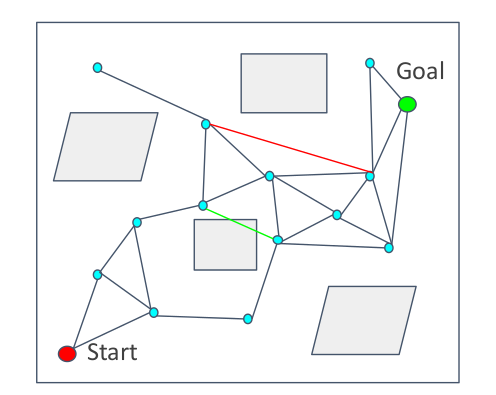
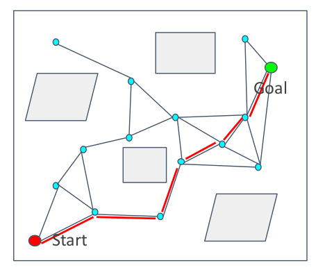
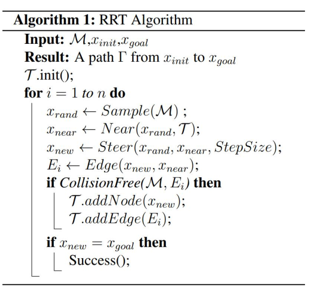

# Sample-based Path Finding
## Notion of Completeness Planning
+ Complete: always answers a path planning query correctly in bounded time
+ Probabilistic Complete: if solution exists, planner will eventually find it, using random sampling
+ Resolution Complete: same as "Probabilistic" but based on a deterministic sampling (e.g. sampling on a fixed grid)

## Probabilistic Road Map
**PRM**:
+ A graph structure
+ Two phases planning:
	+ **Learning** 
	+ **Query**
+ Collision checking can be done efficiently
+ A relatively small number of nodes and connections are sufficient to capture the connectivity of the free space
### Learning Phase
+ Sample N points in C-space (Detect the space using random points)
+ Delete collision points
+ 
+ Connect the nearest points and get collision-free segment 
+ Delete collision segments
+ 
### Query Phase
+ Search on the road map to find a path (using Dijkstra or A*)
+ Road map is now similar with the grid map (simplified)
+ 

### Pros and Cons
+ **Pros:**
	+ Probabilistic complete
+ **Cons:**
	+ Required to solve 2 point boundary value problem
	+ Build graph but not focus on generating a path
	+ Not efficient

### Lazy Collision-Checking
Collision-checking is time-consuming (in complex or high-dimensional env).  
**Towards Improving Efficiency.**
+ **Sample points and segments without checking (Lazy)**
+ Collision-checking if necessary: 
	+ **find path, if the path is not free, delete the collision edge and nodes**
	+ **restart finding path**

## Rapidly-Exploring Random Tree

