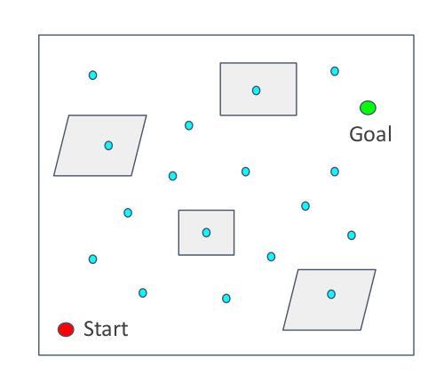

# Sample-based Path Finding
## Notion of Completeness Planning
+ Complete: always answers a path planning query correctly in bounded time
+ Probabilistic Complete: if solution exists, planner will eventually find it, using random sampling
+ Resolution Complete: same as "Probabilistic" but based on a deterministic sampling (e.g. sampling on a fixed grid)

## Probabilistic Road Map
PRM:
+ A graph structure
+ Two phases planning:
	+ Learning 
	+ Query
+ Collision checking can be done efficiently
+ A relatively small number of nodes and connections are sufficient to capture the connectivity of the free space
### Learning Phase
+ Sample N points in C-space
+ Delete collision points
+ 
+ 