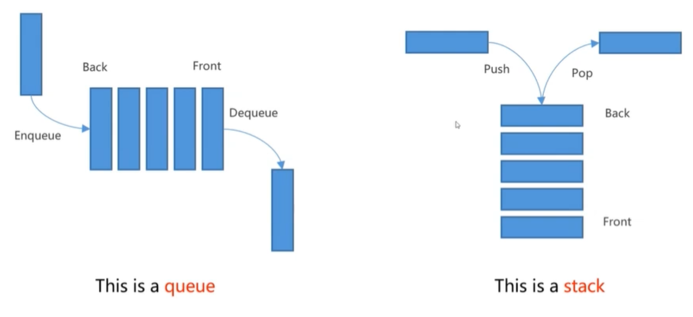
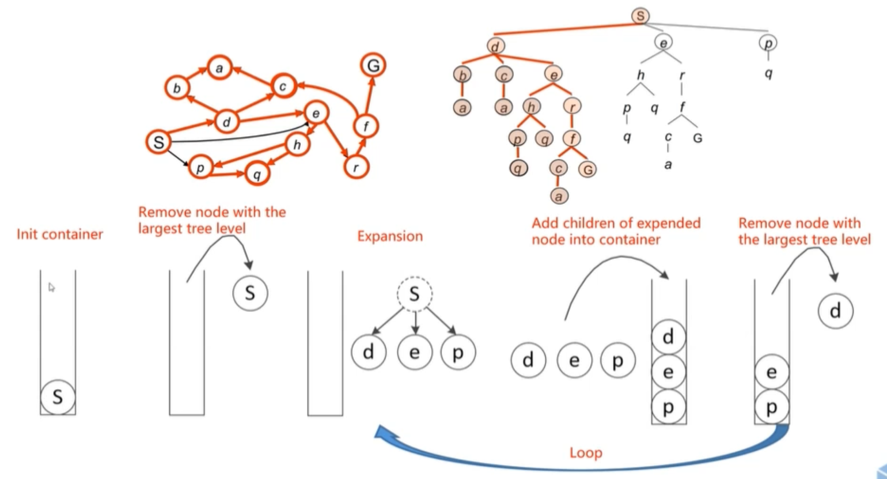
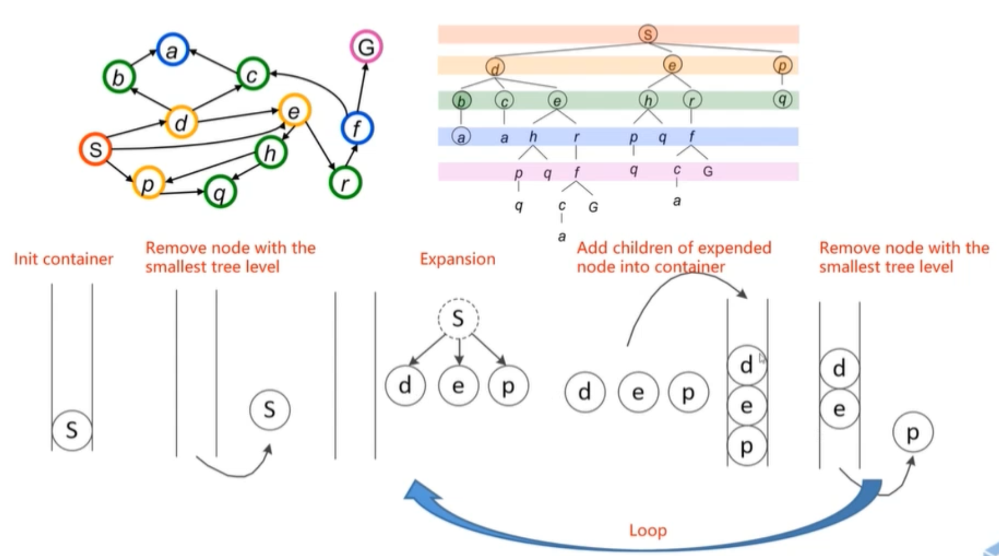

# Search-based Path Finding
## Configuration Space

**Planning in workspace:**
+ Robot has different shape and size
+ collision detection is time consuming and hard

**Planning in configuration space:**
+ Robot is a point in C-space, e.g. position (point in $R^3$), pose (point in $SO(3)$)
+ Obstacles -> C-obstacles
+ C-space = C-free + C--obstacle
+ The path planning is finding a path between start point and end point within C-free.

## Graph and Search Method
### Graph

### Search-based method
**State space graph: a mathematical representation of a search algorithm**  

**The search start from start state: **  
+ Searching -> a search tree
+ Back-tracking in the tree -> the path from start to the node
+ For many problems we can never build the whole tree (too large or inefficient)

## Graph Search Overview
+ Maintain a **container** to store all the nodes **to be visited**
+ The container is initialized with start state
+ Loop
	+ **Remove** a node from the container according to score function
	+ **Expansion:** Obtain all neighbors of the node
	+ **Push** them into container
+ End Loop

**Q1: When to end loop**
+ Possible: when the container is empty

**Q2: What if the graph is cyclic
+ When a node is visited, it should never be added back to the container

**Q3: In what way to remove the node such that the goal can be reached as soon as possible, which results in less expansion**

## Graph Traversal
**Breath First Search (BFS) vs. Depth First Search (DFS)**  
+ BFS: queue (first in first out)
+ DFS: stack (last in first out)

### Depth First Search (DFS)
**Strategy:** remove / expand the deepest node in the container
**Implementation:** main a LIFO container (i.e. stack)

### Breath First Search (BFS)
Strategy:** remove / expand the shallowest node in the container
**Implementation:** main a FIFO container (i.e. queue)

### Greedy Best First Search
