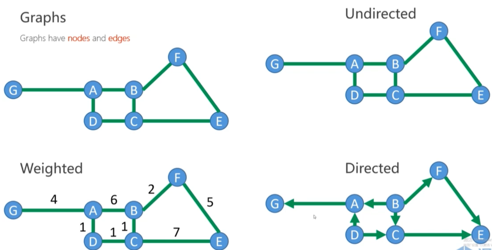

# Search-based Path Finding
## Configuration Space

**Planning in workspace:**
+ Robot has different shape and size
+ collision detection is time consuming and hard

**Planning in configuration space:**
+ Robot is a point in C-space, e.g. position (point in $R^3$), pose (point in $SO(3)$)
+ Obstacles -> C-obstacles
+ C-space = C-free + C--obstacle
+ The path planning is finding a path between start point and end point within C-free.

## Graph and Search Method
### Graph

