# Search-based Path Finding
## Configuration Space
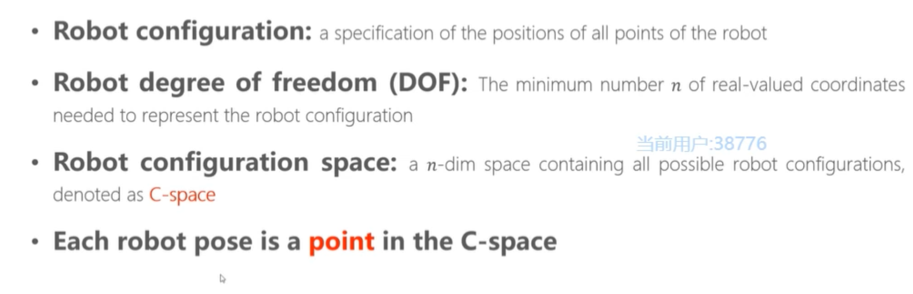

**Planning in workspace:**
+ Robot has different shape and size
+ collision detection is time consuming and hard

**Planning in configuration space:**
+ Robot is a point in C-space, e.g. position (point in $R^3$), pose (point in $SO(3)$)
+ Obstacles -> C-obstacles
+ C-space = C-free + C--obstacle
+ The path planning is finding a path between start point and end point within C-free.

## Graph and Search Method
### Graph
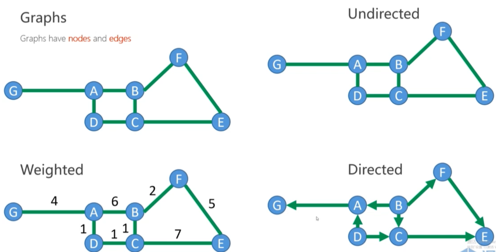

### Search-based method
**State space graph: a mathematical representation of a search algorithm**  

**The search start from start state: **  
+ Searching -> a search tree
+ Back-tracking in the tree -> the path from start to the node
+ For many problems we can never build the whole tree (too large or inefficient)
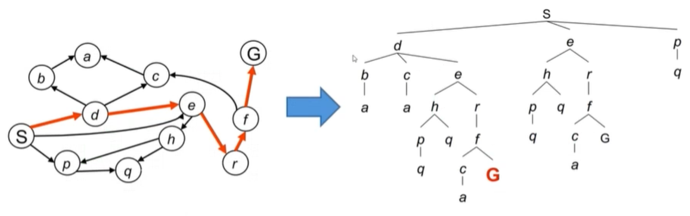

## Graph Search Overview
+ Maintain a **container** to store all the nodes **to be visited**
+ The container is initialized with start state
+ Loop
	+ **Remove** a node from the container according to score function
	+ **Expansion:** Obtain all neighbors of the node
	+ **Push** them into container
+ End Loop

**Q1: When to end loop**
+ Possible: when the container is empty

**Q2: What if the graph is cyclic
+ When a node is visited, it should never be added back to the container

**Q3: In what way to remove the node such that the goal can be reached as soon as possible, which results in less expansion**

## Graph Traversal
**Breath First Search (BFS) vs. Depth First Search (DFS)**  
+ BFS: queue (first in first out)
+ DFS: stack (last in first out)

### Depth First Search (DFS)
**Strategy:** remove / expand the deepest node in the container
**Implementation:** main a LIFO container (i.e. stack)
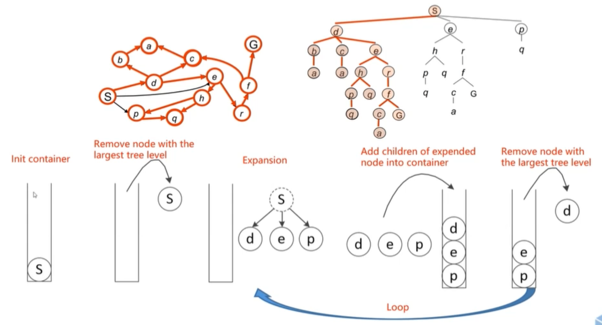

### Breath First Search (BFS)
**Strategy:** remove / expand the shallowest node in the container
**Implementation:** main a FIFO container (i.e. queue)  
*If all weights are 1, BFS can get the optimal path*
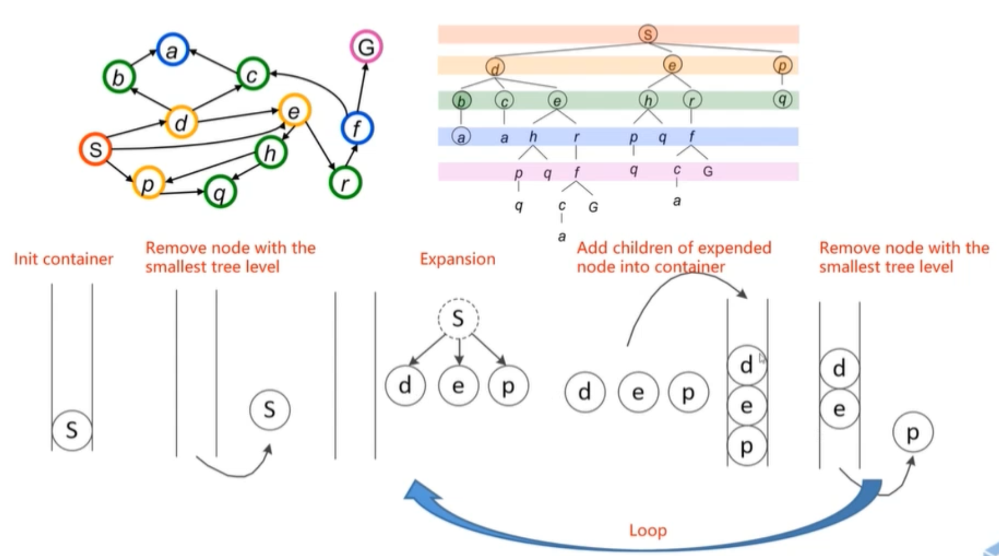

### Greedy Best First Search (Heuristic)
**A heuristic is a guess of how close you are to the target:**  
+ guides in the right direction
+ easy to compute
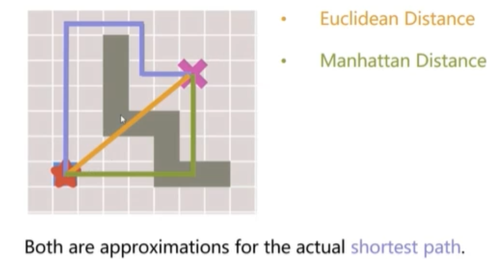

### Cost on Actions
+ A practical search problem has a **cost** from a node to its neighbor
+ When all weights are 1, BFS finds the optimal solution
+ For general case, how to find the **least-cost path** as soon as possible?

## Dijkstra Algorithm
**Strategy:** remove / expand the node with **cheapest accumulated cost $g(n)$**
+ $g(n)$: The current best estimates of the accumulated cost from the start to node $n$
+ Update the accumulated cost $g(m)$ for all unexpanded neighbors $m$ of node $n$
+ An expanded node have the smallest cost from the start state
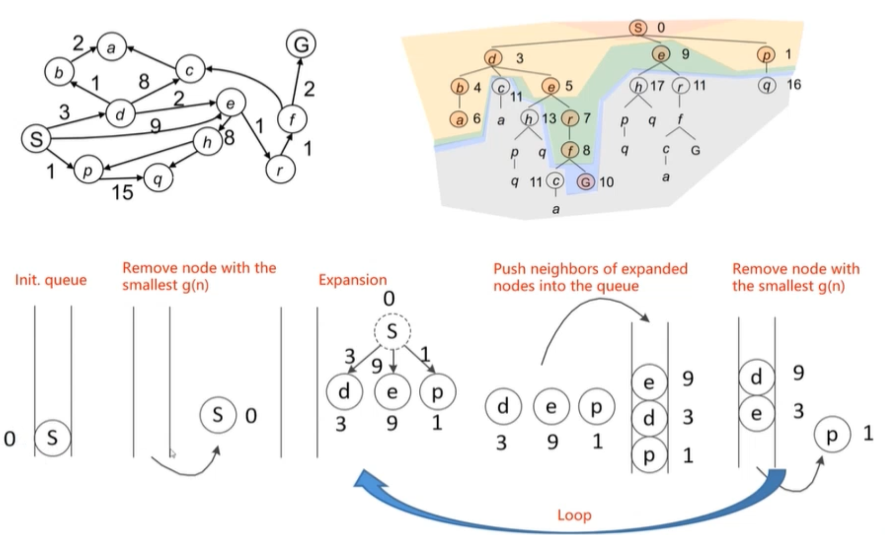

### Algorithm overflow
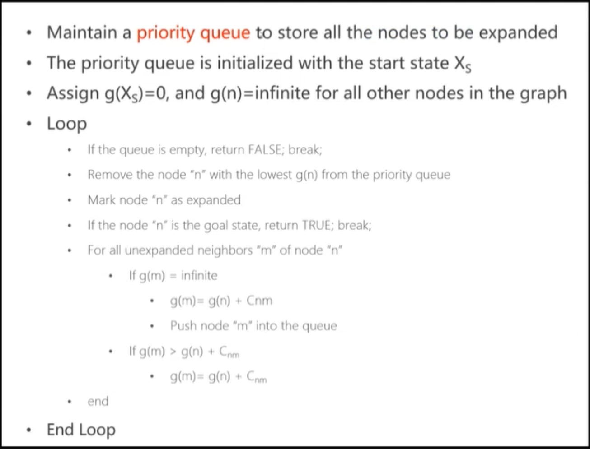

### Pros and Cons
+ **Good:** 
	+ Complete and Optimal
+ **Bad:** 
	+ Exploring next in every direction
	+  No information about goal

## A*: Dijkstra with a Heuristic
+ **Accumulated cost:** $g(n)$
+ **Heuristic:** 
	+ $h(n)$: The estimated least cost from node $n$ to the goal
+ $f(n)=g(n)+h(n)$
+ **Strategy:** remove / expand the node with **cheapest** $f(n)$ 
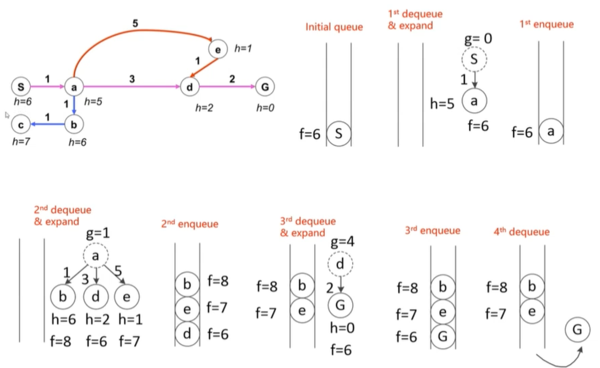

### Algorithm
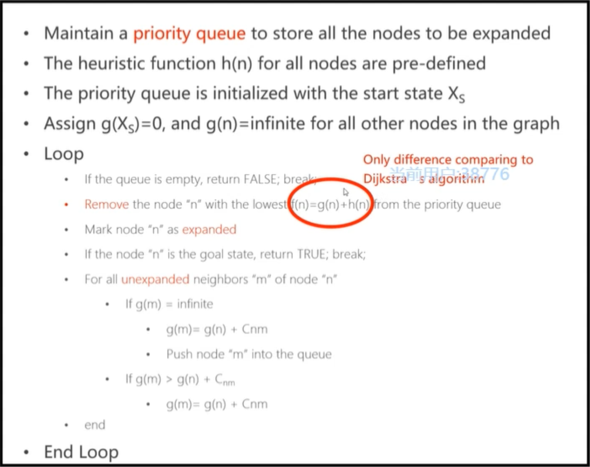

### A* Optimality
**To keep the optimal:**
+ The estimated least cost to goal (heuristic) < The actual least cost

### Admissible Heuristics
+ A Heuristic $h(n)$ is admissible if $h(n)<h^*(n)$ , $h^*(n)$ is the actual least cost to goal
+ If the heuristic is admissible, A* is optimal

### Heuristic Design
Case by case !  

Generally, 
+ $L2$ norm (Euclidean Distance): always
+ $L1$ norm (Manhattan Distance): depends
+ $L\infty$ norm: always
+ 0 distance: always 
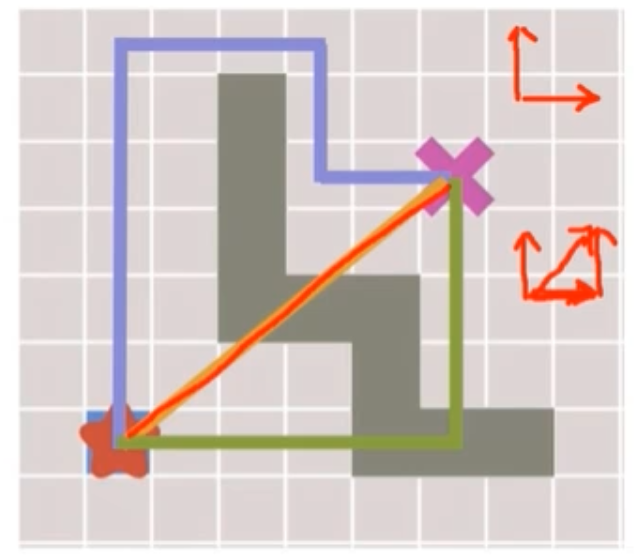

### Sub-optimal Solution
Use an over-estimated heuristic:  
+ Sub-optimal path
+ Faster

=>**Weighted A*:**
+ $f=g+\epsilon*h, (\epsilon>1)$ bias towards the goal state
+ Optimality vs. speed
+ $\epsilon$-suboptimal: cost(solution) <= $\epsilon*$cost(optimal solution)
+ can be orders of magnitude faster than A*
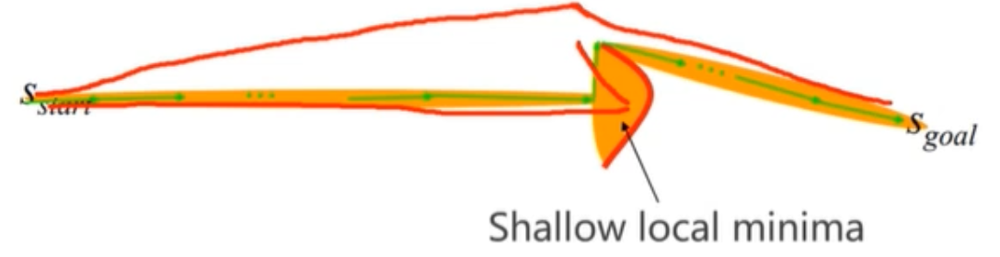

### Engineering Considerations
**Represent the grid as graph**
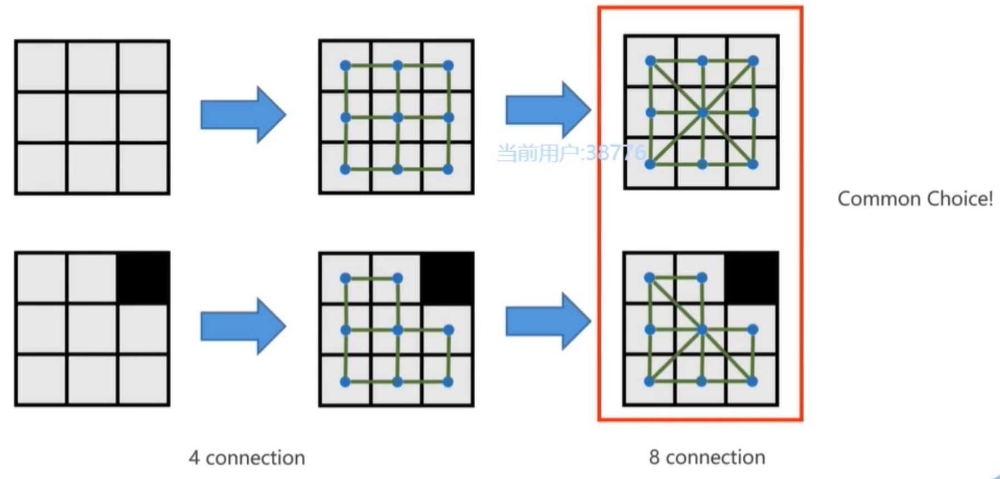

**Priority queue in C++:**
+ `std::priority_queue`
+ `std::make_heap`
+ `std::multimap`

#### **The Best Heuristic:**  
$L2$ norm, $L\infty$ norm and 0 distance are all admissible,  but **none of them** is the best choice.  
Because **not tight**.  
**Tight:** The $h(n)$ is near $h^*(n)$.  

For Euclidean Heuristic, too many nodes are expanded, since the Euclidean distance is far from the **truly theoretical optimal solution**.
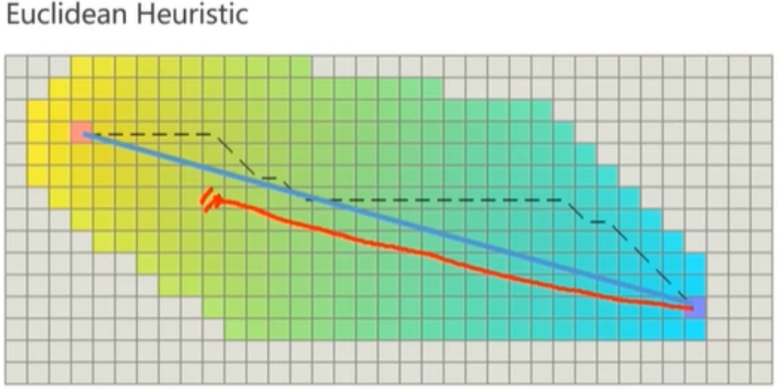

How

