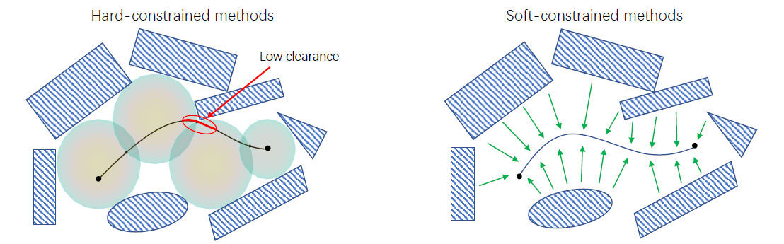

# Soft Constrained Trajectory Optimization
## Distance-based Trajectory Optimization
### Motivation

For a vision-based drone:
+ Limited sensing range and quality
+ Noisy depth estimation
Hard-constrained method:
+ Treat all free space equally
+ Solution space is sensitive to noise

### Problem Formulation

**Piecewise Polynomial Trajectory**
$$
f_\mu(t)=\left\{\begin{array}{cc}
\sum_{j=0}^N p_{1 j}\left(t-T_0\right)^j & T_0 \leq t \leq T_1 \\
\sum_{j=0}^N p_{2 j}\left(t-T_1\right)^j & T_0 \leq t \leq T_1 \\
\vdots & \vdots \\
\sum_{j=0}^N p_{M j}\left(t-T_{M-1}\right)^j & T_0 \leq t \leq T_1
\end{array}\right.
$$

**Objective Function**
$$
\begin{aligned}
 J&=J_s+J_c+J_d \\
& =\lambda_1 J_1+\lambda_2 J_2+\lambda_3 J_3
\end{aligned}
$$
where $J_s$ is smooth cost, $J_c$ is collision cost, $J_d$ is dynamic cost.

+ Smoothness Cost: minimum snap formulation $$\begin{aligned}J_s & =\sum_{\mu \in\{x, y, z\}} \int_0^T\left(\frac{d^k f_\mu(t)}{d t^k}\right)^2 d t \\& =\left[\begin{array}{l}\boldsymbol{d}_F \\\boldsymbol{d}_P\end{array}\right]^T \boldsymbol{C}^T \boldsymbol{M}^{-T} \boldsymbol{Q} \boldsymbol{M}^{-1} \boldsymbol{C}\left[\begin{array}{l}\boldsymbol{d}_F \\\boldsymbol{d}_P\end{array}\right]=\left[\begin{array}{l}\boldsymbol{d}_F \\\boldsymbol{d}_P\end{array}\right]^T\left[\begin{array}{ll}\boldsymbol{R}_{F F} & \boldsymbol{R}_{F P} \\\boldsymbol{R}_{P F} & \boldsymbol{R}_{P P}\end{array}\right]\left[\begin{array}{l}\boldsymbol{d}_F \\\boldsymbol{d}_P\end{array}\right]\end{aligned}$$