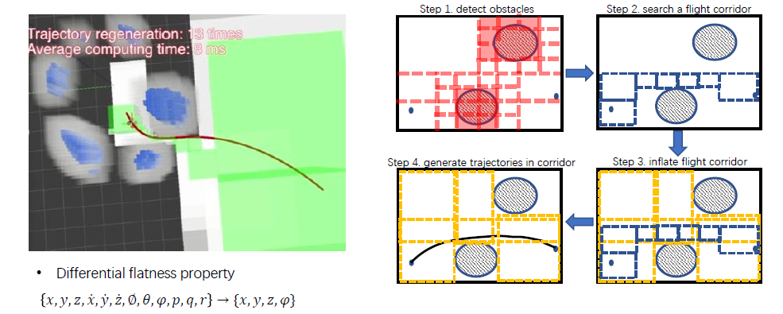

# Soft and Hard Constrained Trajectory Optimization
**Minimum snap**: good for smooth, not for collision avoidance
+ only constrain the intermediate waypoints
+ computational cheap and easy to implenmentation
+ no constraints on the trajectory itself
+ "overshoot" unavoidable

**Minimum snap with safety constraints:**
+ Adding forces
+ Adding bounds

## hard/soft constraints

**hard constraints:** The constraints are required to be strictly satisfied
$$
\begin{array}{ll}
\min & f(x) \\
\text { s.t. } & g_i(x)=c_i, \quad i=1, \cdots, n \quad \text { Equality constraints } \\
& h_j(x) \geq d_j, \quad j=1, \cdots, n \quad \text { Inequality constraints }
\end{array}
$$

**soft constraints:**
$$
\min  f(x)+\lambda_1\cdot g(x)+\lambda_2\cdot h(x)
$$
+ Penalty terms / loss functions
+ Constraints which are preferred but not strictly required
+ Various kind of loss function

## Corridor-based Trajectory Optimization

+ Cost function: $J=\sum_{\mu \in\{x, y, z\}} \int_0^T\left(\frac{d^k f_\mu(t)}{d t^k}\right)^2 d t$
+ Boundary constraints
+ Continiuty constraints
+ Safety constraints
+ $$\begin{array}{ll}\min & \mathbf{p}^T \mathbf{H p} \\\text { s.t. } & \mathbf{A}_{e q} \mathbf{p}=\mathbf{b}_{e q} \\& \mathbf{A}_{l q} \mathbf{p} \leq \mathbf{b}_{l q}\end{array}$$
**Instant linear constraints:**
+ start, goal constraint: $\mathbf{A}\mathbf{p}=\mathbf{b}$
+ transition point constraint: $\mathbf{A}\mathbf{p}=\mathbf{b},\mathbf{A}\mathbf{p}\leq\mathbf{b}$
+ continuity constraint: $\mathbf{A}\mathbf{p}_i=\mathbf{A}\mathbf{p}_{i+1}$

**Interval linear constraints:** (hard to implement, apporiximated by enforcing the intermediate points in the overlapping area)
+ boundary constraint: $\left(\mathbf{A}(t) \mathbf{p} \leq \mathbf{b}, \forall t \in\left[t_l, t_r\right]\right)$
+ dynamic constraint: $\left(\mathbf{A}(t) \mathbf{p} \leq \mathbf{b}, \forall t \in\left[t_l, t_r\right]\right)$
	+ velocity constraint
	+ acceleration constraint

**Advantages:**
+ Efficiency: path search in the reduced graph, convex optimization in the corridor are efficient
+ High quality: corridor provides large optimization freedom

**Problem**:  
All constraints are enforced on joints only, how to guarantee they are active along all trajectory?
+ Iteratively check extremum and add extra constraints.
+ Checking extremum is a polynomial root finding problem
	+ up to quadratic function, easy
	+ higher order, need numerical solution
+ Root finding using the MATLAB provided way:
	+ The general polynomial function has the companion matrix: $$A=\left[\begin{array}{ccccc}0 & 0 & \cdots & 0 & -a_0 \\1 & 0 & \cdots & 0 & -a_1 \\0 & 1 & \cdots & 0 & -a_2 \\\vdots & & \ddots & & \vdots \\0 & 0 & \cdots & 1 & -a_{n-1}\end{array}\right]$$
	+ The characteristic polynomial $det(xI-A)$ of $A$ is the polynomial $p(x)$.
	+ In other word, the eigen values of $A$ are the solutions.

## Bezier Curve Optimization
