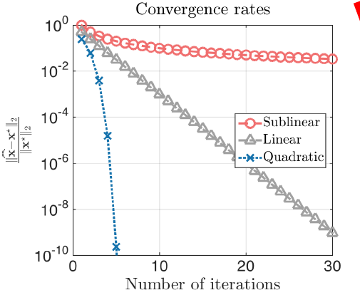

# Quasi-Newton Method

#math #optimization #quasi-newton

## Covergence Speed

Define the error$$e^k=x^k-x^*$$
+ Linear convergence: $\left\|e^{k+1}\right\|=C\left\|e^k\right\|$ (gradient)
+ Quadratic convergence: $\left\|e^{k+1}\right\|=C\left\|e^k\right\|^2$ (Newton)
+ Superlinear convergence: $\left\|e^{k+1}\right\|=C\left\|e^k\right\|^p, p>1$

## Approximation

Newton approximation (PD Hessian $H$):
$$
\begin{array}{c}
f(x)-f\left(x^k\right) \approx\left(x-x^k\right)^T g^k+\frac{1}{2}\left(x-x^k\right)^T H^k\left(x-x^k\right) \\
\text{Solve }  H^k d^k=-g^k
\end{array}
$$
**Quasi-Newton approximation**:
$$
\begin{array}{c}
f(x)-f\left(x^k\right) \approx\left(x-x^k\right)^T g^k+\frac{1}{2}\left(x-x^k\right)^T M^k\left(x-x^k\right) \\
\text{Solve }  M^k d^k=-g^k
\end{array}
$$
where $M$ should satisfy:
+ not need full 2nd-order derivatives
+ linear equations have closed-form solutions
+ lightweight and compact to store
+ **preserve descent directions**
+ **contaion curvature info (local quadratic approx.)**

### Preserve Descent Direction
The direction satisfy
$$
M^k d^k=-g^k \Rightarrow d^k=-(M^k)^{-1}g^k
$$
The discent direction means $d$ makes acute angle with $-g$
$$
\left\langle-g,-M^{-1} g\right\rangle=\left\langle g, M^{-1} g\right\rangle=g^T M^{-1} g>0
$$
i.e. $M$ must be PD.
### Curvature Info
According to the Taylor expansion of $\nabla f(x)$:
$$
\nabla f(x)-\nabla f(y) \approx H(x-y)
$$
If
$$
\begin{aligned}
& \Delta x=x^{k+1}-x^k \\
& \Delta g=\nabla f\left(x^{k+1}\right)-\nabla f\left(x^k\right)
\end{aligned}
$$
then
$$
\Delta g \approx M^{k+1}\Delta x
$$
that is 
$$
\Delta x \approx B^{k+1}\Delta g, M^{k+1}B^{k+1}=I
$$
Because we need to solve $d=-M^{-1}g$, so directly get $B^{k+1}=(M^{k+1})^{-1}$ is better.
Infinitely many $B$ satisfy $\Delta x \approx B\Delta g$, so we can choose using a optimization problem.
$B^{k}$ may contain some info related to $B^{k+1}$, so we want $B^{k+1}$ close to $B^k$,
$$
\begin{array}{c}
\min _B \left\|B - B^k\right\|^2 \\
\begin{aligned}
\text { s.t. }  B&=B^{\mathrm{T}} \\
\Delta x &=B \Delta g
\end{aligned}
\end{array}
$$
However, the scale of each element of $B$ may differ a lot, so it's more reasonable to measure the relative change of the element:
$$
\begin{array}{c}
\min _B \left\| H^\frac{1}{2}\left(B - B^k\right)H^\frac{1}{2}\right\|^2 \\
\begin{aligned}
\text { s.t. }  B&=B^{\mathrm{T}} \\
\Delta x &=B \Delta g
\end{aligned}
\end{array}
$$
where $H$ is the average true Hessian from $x^k$ to $x^{k+1}$,
$$
H=\int_0^1 \nabla^2 f\left[(1-\tau) x^k+\tau x^{k+1}\right] d \tau
$$
***We don't know $H$, but the problem has an analytical solution independent of $H$.***
