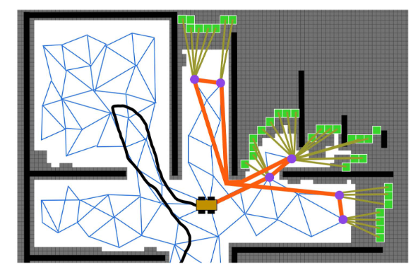

# FAEL: Fast Autonomous Exploration for Large-scale Environments With a Mobile Robot

## Metadata
- **CiteKey**: huangFAEL2023
- **Type**: Journal Article
- **Title**: FAEL: Fast Autonomous Exploration for Large-scale Environments With a Mobile Robot
- **Author**: Huang, Junlong; Zhou, Boyu; Fan, Zhengping; Zhu, Yilin; Jie, Yingrui; Li, Longwei; Cheng, Hui 
- **Journal**: IEEE Robotics and Automation Letters
- **Year**: 2023 

## Abstract
Autonomous exploration in large-scale and complex environments is a challenging task. As the size of the environment increases, the significant overhead of exploration algorithms could overwhelm the computational capability of mobile platforms, prohibiting timely response to environmental changes. Meanwhile, the quality of exploration paths becomes increasingly important in larger scenes, as poorly selected paths greatly reduce efficiency. In this letter, a systematic framework is proposed to explore large-scale unknown environments. To enable high-frequency planning, a fast preprocessing of environmental information is presented, providing fundamental information to support high-frequency path planning. An path optimization formulation that comprehensively considers key factors about fast exploration is introduced. Further, an heuristic algorithm is devised to solve the NP-hard optimization problem, which empirically finds optimal solution in real time. Simulation results show the run time of our method is significantly shorter than existing ones. Our method completes exploration with the least time and shortest movement distance compared to current state-of-the-art methods.
## Files and Links
- **Local Library**: [Zotero](zotero://select/library/items/PLEDECGG)
- **File**:[Huang_2023_FAEL.pdf](zotero://open-pdf/library/items/IYUAUB3T); [IEEE Xplore Abstract Record](zotero://open-pdf/library/items/Z2SXXQSV)

## Tags and Collections
- **Keywords**: /unread; Optimization; Planning; Robots; Search and rescue robots; Sensors; Simultaneous localization and mapping; Space exploration; Three-dimensional displays; autonomous agents; motion and path planning

---

## Comments
*   Exploration
*   Frontier-based
*   Frontier->Viewpoints Sampling->Path Optimization
*   Contribution
    
    *   Fast preprocessing of environmental information to obtain frontiers, viewpoints, distance.
    *   Path optimization to consider both the information and distance. An approximate algorithm to solve NP-hard problem.

---

## Method
Frontiers are extracted, candidate viewpoints are sampled and their information gains are evaluated in an efficient incremental manner. A sparse free-space roadmap is expanded. An efficient path optimization outputs the optimal path that considers movement distance, information gain and global coverage.

### Fast preprocessing of environmental information
+ **Frontier Detection:** New frontiers are searched within newly updated grids, and the existing frontiers around the robot are rechecked.
+ **Viewpoint Generation and Gain Evaluation:** Sample viewpoints around the robot in the free space. The frontiers within the sensor range are connected to their nearest visible sample point. The information gains  of viewpoints are evaluated as the number of attached frontiers. High gain viewpoints are reserved.
+ **Sparse Roadmap for Movement Distance:** Uniform sampling to build an sparse roadmap to calculate the distance between viewpoints.
### Path Optimization
+ Find a path maximizing $\mathbf{v}^* =\max \sum_{k=1}^n \mathbf{U}\left(v_k\right)=\max \sum_{k=1}^n \mathbf{G}\left(v_k\right) \cdot \mathbf{P}\left(v_k\right)=\max \sum_{k=1}^n \mathbf{G}\left(v_k\right) \cdot \exp \left(-c \cdot \mathbf{L}\left(v_0 \cdot v_k\right)\right)$
+ $\mathbf{v}=[v_{1},v_{2},\dots,v_{n}]$ is the sequence  of viewpoints, $\mathbf{G}(v_{k})$ is the information gain, $\mathbf{L}\left(v_0 \cdot v_k\right)$ is the cumulative movement distance from $v_{0}$ to $v_{k}$.
+ A method based on 2-opt local search heuristic to solve the NP-hard problem.
  > Firstly, an initial path $\rho_{\text {init }}=\left[v_0, v_1, v_2, \ldots, v_n\right]$ is found by sorting the information gains in descending order. Secondly, two viewpoints are selected randomly and the subsequence between them are reversed. Then a set of paths are acquired by selecting all possible two viewpoints. The total utility of each path is calculated by $\sum_{k=1}^{n}\mathbf{U}(v_{k})$, and the path with the highest utility is determined. Thirdly, the second step is executed again, using the highest utility path as the initial path. This is repeated until there is no higher utility path.
+ **Further speed up**: Only viewpoints within the radius R of the robot are taken into account; viewpoints with low information gain are ignored; many of the previously computed paths between viewpoints are queried.
  

---

## Extracted Annotations
