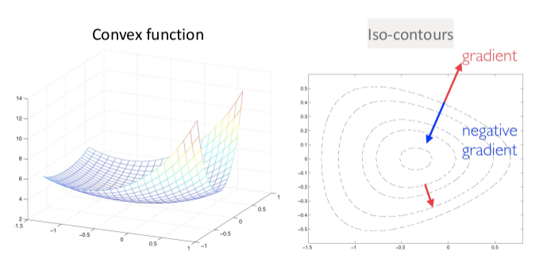

# Steepest Gradient Descent

#math #optimization

## Unconstrained optimization

An unconstrained optimization is formed as 

$$

\begin{aligned}&\min{f(x)}  \\  &x=\left(x_1,\dots,x_n \right)\in\mathbb{R}^n\\&f:\mathbb{R}^n\mapsto\mathbb{R}\end{aligned}
$$

## Line-Search Steepest Gradient Descent

Iteration: $x^{k+1}=x^{k}-\tau\nabla f(x^k)$

We can formed it as: 

$$
\begin{aligned}&x^{k+1}=x^k+\tau d
\\&d=-\nabla f(x^k)\end{aligned}
$$

For the step size $\tau$ :

- Constant                   $\tau=c$        (not intelligent)
- Diminishing               $\tau=c/k$
    - Robbins-Mono rule, robust but slow
- Exact line search      $\tau = \arg \min _\alpha f\left(x^k+\alpha d\right)$
    - Solving the sub optimization problem is needed, generally nontrivial
- Inexact line search   $\tau \in\left\{\alpha \mid f\left(x^k\right)-f\left(x^k+\alpha d\right) \geq-c \cdot \alpha d^{\mathrm{T}} \nabla f\left(x^k\right)\right\}$
    - Like Armijo condition which is easy to satisfy

### Constant Step Size

- Too large: may oscillate and diverge
- Too small: may be too slow
- “Just right”: fast convergence

### Armijo condition (sufficient decrease condition)

The condition is as followed: 

$$
\tau \in\left\{\alpha \mid f\left(x^k\right)-f\left(x^k+\alpha d\right) \geq-c \cdot \alpha d^{\mathrm{T}} \nabla f\left(x^k\right)\right\}\\c\in\left(0,1\right)
$$

To explain the condition, we define $\phi(\alpha)=f(x^k+\alpha d)$, so the derivative $\phi'(\alpha)=d^\top \nabla f(x^k+\alpha d)$. The $d^\top\nabla f(x^k)$ is the derivative at $\alpha=0$. We scalar $\phi'(0)$ with a parameter $c$, and we can get a line  $l(\alpha)=f(x^k)+c\cdot\alpha d^\top\nabla f(x^k)$.

If for $\alpha$, $\phi(\alpha)$ decrease more than $l(\alpha)$, we consider it as sufficient decrease.

For convex function:

For non-convex function:

### Backtracking Armijo line search

Considering the Armijo condition, if $\tau$ is small enough, it will meet the condition, but the small step size results in the slow convergence.

We want the $\tau$ to be a bit large, and far away from $0$.

So the backtracking Armijo line search is as below:

### Comparison between Exact/Inexact line search

 Although the inexact line search needs more iterations, it doesn’t need the sub optimization problem which the exact line search needs. 

**Fewer iterations do not guarantee higher efficiency.**

### Drawbacks:

- Gradients are perpendicular to contours

- Poor conditioning causes performance degeneration

So, **curvature info is needed !**
