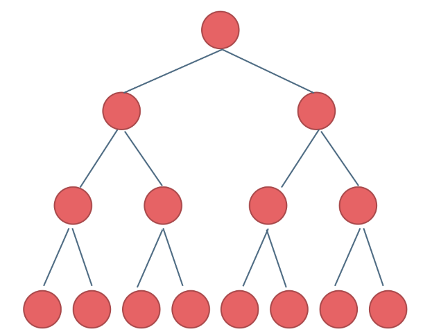
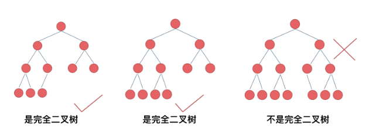
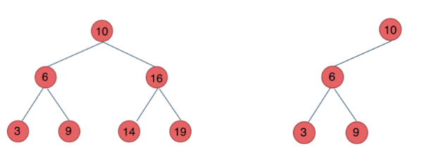
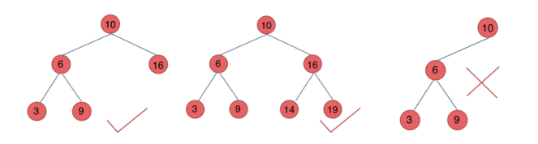
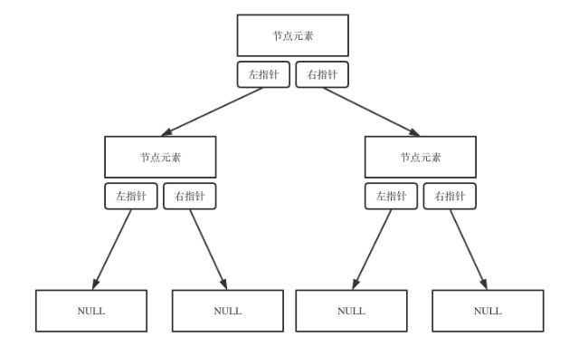
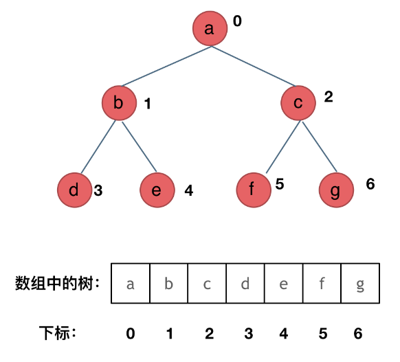

# 二叉树

#data_structure #algorithm

## 种类

### 满二叉树

节点数量：$2^k-1$。  

### 完全二叉树

只有最底层节点不满，且从左到右连续。  

### 二叉搜索树

左子树节点小于中间节点，右子树节点大于中间节点。    
搜索时间复杂度：$O(\log N)$。

### 平衡二叉搜索树

左子树和右子树高度差不超过1。  
`map`,  `multimap`, `set`, `multiset` 的底层实现都是平衡二叉搜素树。 

## 存储方式

### 链性存储

### 顺序存储

父节点下标为 $i$, ，则左子节点下标 $2i+1$，右子节点下标 $2i+2$。  

## 遍历方式

### 深度优先搜索

一般用递归实现。也可用迭代法实现。  
+ 前序遍历：中左右
+ 中序遍历：左中右
+ 后序遍历：左右中

### 广度优先搜索

迭代法。
+ 层序遍历

## 定义方式

```cpp
struct TreeNode {
	int val;
	TreeNode* left;
	TreeNode* right;
	TreeNode(t): val(t), left(NULL), right(NULL) {}
};
```
