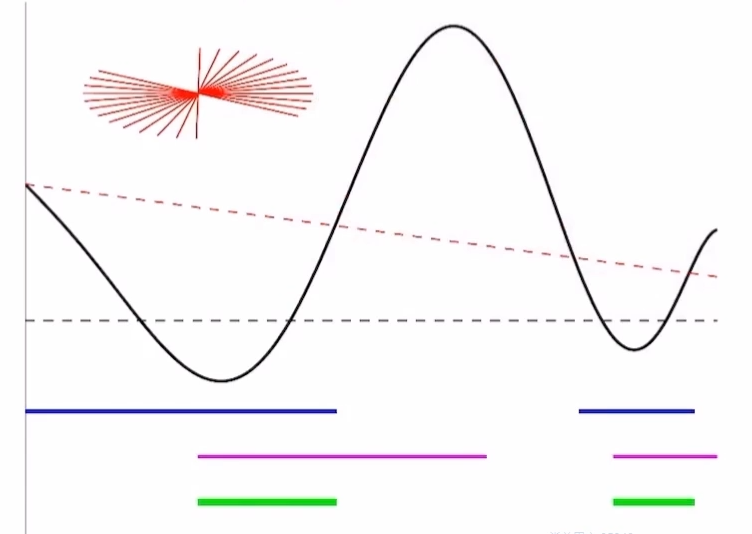
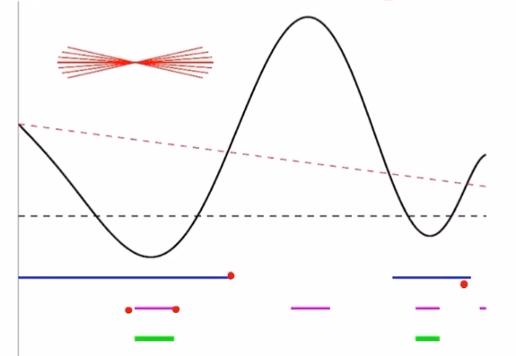
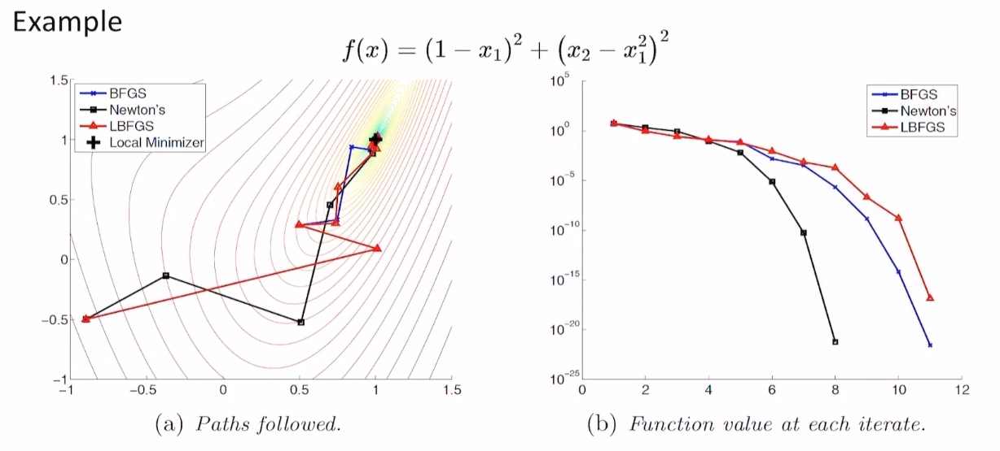
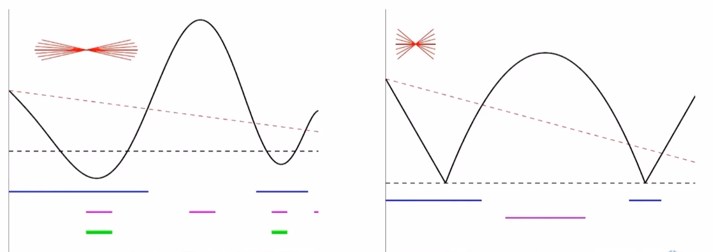

# 数值优化-BFGS
根据前文的拟牛顿法，我们希望求得矩阵 $B$ 来近似海森阵的逆，从而还原出海森阵中的曲率信息，满足
$$
\Delta x \approx B^{k+1}\Delta g, M^{k+1}B^{k+1}=I
$$
因为满足要求的矩阵有无数多个，因此通过构建优化问题，来求得一个最优的 $B$：
$$
\begin{array}{c}
\min _B \left\| H^\frac{1}{2}\left(B - B^k\right)H^\frac{1}{2}\right\|^2 \\
\begin{aligned}
\text { s.t. }  B&=B^{\mathrm{T}} \\
\Delta x &=B \Delta g
\end{aligned}\\
H=\int_0^1 \nabla^2 f\left[(1-\tau) x^k+\tau x^{k+1}\right] d \tau
\end{array}
$$
## BFGS更新

我们可通过**BFGS更新**公式来求得满足要求的矩阵 $B$：
$$
\begin{aligned}
& B^{k+1}=\left(I-\frac{\Delta x \Delta g^T}{\Delta g^T \Delta x}\right) B^k\left(I-\frac{\Delta g \Delta x^T}{\Delta g^T \Delta x}\right)+\frac{\Delta x \Delta x^T}{\Delta g^T \Delta x} \\
& B^0=I, \Delta x=x^{k+1}-x^k, \Delta g=\nabla f\left(x^{k+1}\right)-\nabla f\left(x^k\right)
\end{aligned}
$$
这样， $M=B^{-1}$ 即为海森阵的逆矩阵的近似，且满足：
+ [x] 无需求二阶导数
+ [x] 线性方程组有闭式解（求出 $B$ 后，即可直接求出 $d=-Bg$）
+ [x] 轻量，便于存储（$O(n^2)$）
+ [ ] **保证下降方向**
+ [x] **包含曲率信息**

为了**保证下降方向**，$B=M^{-1}$ 需正定。
我们可以证明：若满足
$$
\Delta g^\top\Delta x > 0
$$
则**BFGS更新可以保留 $B$ 的正定**。  
证明见文章末尾。

## BFGS用于严格凸的光滑函数
对于**严格凸函数**，
$$
\langle y-x,\nabla f(y)-\nabla f(x)\rangle >0\Rightarrow \Delta g^\top\Delta x > 0
$$
因此一定能保证 $d$ 为下降方向。  
用于**严格凸函数**的BFGS算法如下：
$$
\begin{aligned}
&\textbf{initialize}~~ x^{0},g^{0}\leftarrow f(x^{0}),\,B^{0}\leftarrow I,\,k\leftarrow 0\\
&\textbf{while}~~ \Vert g^{k}\Vert>\delta\quad\textbf{do}\\
&\qquad d\leftarrow -B^{k}g^{k}\\
&\qquad t\leftarrow \text{backtracking line serach (Armijo)}\\
&\qquad x^{k+1}\leftarrow x^{k}+td\\
&\qquad g^{k+1}\leftarrow \nabla f(x^{k+1})\\
&\qquad B^{k+1}\leftarrow \text{BFGS}(B^{k},g^{k+1}-g^{k},x^{k+1}-x^{k})\\
&\qquad k\leftarrow k+1\\
&\textbf{end while}\\
&\textbf{return}
\end{aligned}
$$

## BFGS用于非凸函数
对于**非凸函数**，我们可以在**线搜索**中使用 **Wolfe Condition** 来保证 $\Delta g^\top\Delta x > 0$，从而保证下降方向：
$$
\text{Wolfe}\rightarrow \Delta g^{T}\Delta x>0\rightarrow B\text{ is PD}\rightarrow d\text{ 为下降方向}
$$
### Wolfe Condition
#### weak wolfe condition
给定参数 $0<c_{1}<c_{2}<1$, 通常取 $c_{1}=10^{-4},c_{2}=0.9$, **weak wolfe condition** 的表述如下：
$$
\begin{cases}
f\left(x^k\right)-f\left(x^k+\alpha d\right) \geq-c_{1} \cdot \alpha d^{\mathrm{T}} \nabla f\left(x^k\right) \\\\
d^{\mathrm{T}}\nabla f(x^{k}+\alpha d) \geq c_{2}\cdot d^{\mathrm{T}}\nabla f(x^{k})
\end{cases}
$$
其中，第一个条件为**充分下降条件**，与 Armijo 条件相同。  
第二个条件为**曲率条件**。$d^\mathrm{T}\nabla f(x^k)$ 为函数 $\phi(\alpha)=f(x^{k}+\alpha d)$ 在 $\alpha=0$ 时的导数，即对应切线的斜率。由于方向 $d$ 为下降方向，则在遇到第一个极小值前 $\phi'(\alpha)<0$，对于小于0的数乘上一个常数，则 $c_{2}\cdot d^{\mathrm{T}}\nabla f(x^{k})>d^{\mathrm{T}}\nabla f(x^{k})$。当 $f(x^{k}+\alpha d)$ 接近局部极小值时，$\phi'(\alpha)$ 变大并趋于0。因此，该条件保证了导数变化（增大）的足够多，从而防止 $x^k$ 到 $x^{k+1}$ 变化的太少，下降的太慢，同时也使得 $x^{k+1}$ 趋近于局部极小。

如图所示，上方红色的直线表示曲率条件可以接受的导数（切线斜率）范围。当步长较大导致越过了局部极小值时，导数为正，此时也满足条件，因为此时的 $x^{k+1}$ 也可以防止变化过少，虽然对于这轮迭代来说，沿下降方向没有接近极小值，但在总体上来说，这一步迭代仍是有效的。
#### strong wolfe condition
$$
\begin{cases}
f\left(x^k\right)-f\left(x^k+\alpha d\right) \geq-c_{1} \cdot \alpha d^{\mathrm{T}} \nabla f\left(x^k\right) \\\\
\Vert d^{\mathrm{T}}\nabla f(x^{k}+\alpha d)\Vert \geq c_{2}\cdot \Vert d^{\mathrm{T}}\nabla f(x^{k})\Vert
\end{cases}
$$
其中第二个条件称为**强曲率条件**，它保证了 $x^{k}+\alpha d$ 在极小值附近，防止了步长太大，如图所示。

Strong wolfe condition 可以抑制振荡。

综上，
$$
\text{Strong Wolfe}\rightarrow \text{Weak Wolfe}\rightarrow \Delta g^{T}\Delta x>0\rightarrow B\text{ is PD}\rightarrow \text{descent}
$$
在实际中，**weak wolfe**已经足够用来保证算法的鲁棒性了。

### Cautious Update
在一些情况下，wolfe condition 无法保证 BFGS 一定收敛。因此，可以通过 **cautious update** 来保证收敛：
$$
B^{k+1}=
\begin{cases}
&\left(I-\frac{\Delta x \Delta g^T}{\Delta g^T \Delta x}\right) B^k\left(I-\frac{\Delta g \Delta x^T}{\Delta g^T \Delta x}\right)+\frac{\Delta x \Delta x^T}{\Delta g^{T} \Delta x}\quad &\text{if}\,\Delta g^T\Delta x>\epsilon\Vert g_k\Vert\Delta x^T\Delta x,\epsilon=10^{-6}\\
&B^k &\text{otherwise}
\end{cases}
$$
上述更新 $B$ 的条件也叫做 Li-Fukushima 条件。  

综上，对于可能**非凸的函数**，BFGS算法如下：
$$
\begin{aligned}
&\textbf{initialize}~~ x^{0},g^{0}\leftarrow f(x^{0}),\,B^{0}\leftarrow I,\,k\leftarrow 0\\
&\textbf{while}~~ \Vert g^{k}\Vert>\delta\quad\textbf{do}\\
&\qquad d\leftarrow -B^{k}g^{k}\\
&\qquad t\leftarrow \text{inexact line serach (Wolfe)}\\
&\qquad x^{k+1}\leftarrow x^{k}+td\\
&\qquad g^{k+1}\leftarrow \nabla f(x^{k+1})\\
&\qquad B^{k+1}\leftarrow \text{cautious-BFGS}(B^{k},g^{k+1}-g^{k},x^{k+1}-x^{k})\\
&\qquad k\leftarrow k+1\\
&\textbf{end while}\\
&\textbf{return}
\end{aligned}
$$
在多数情况下，BFGS足够鲁棒，无需 cautious-BFGS。  
每次迭代的复杂度：$O(n^2)$
## Limited-memory BFGS (L-BFGS)
**动机:**
+ 在 BFGS 算法中，$B^k$ 包含了 $\Delta x_i, \Delta g_i, (i=1,\dots,k-1)$ 的所有信息，其中多次迭代前的信息对于当前迭代几乎没有作用。但随着迭代次数的增加，$B^k$ 会变得越来越稠密，秩越来越大，不利于计算。
+ 进一步降低单轮迭代所需的 $O(n^2)$ 复杂度。

因此，可以**只利用 m 对 $\{x^k, g^k\}$ 来还原当前点的曲率信息。**

**Limited-memory BFGS（有限内存的BFGS）:**
$$
s^k=\Delta x^{k+1}=x^{k+1}-x^k,y^k=\Delta g^{k+1}=g^{k+1}-g^k, \rho^k=\frac{1}{\langle s^k,y^k\rangle}
$$
我们不直接存储 $B^k$，而是存储至多 $\mathrm{m}$ 对 $s^k,y^k,\rho^k$。这样，在每轮迭代中，可以通过
$$
\begin{aligned}
&\textbf{for}~~ i=k-m,k-m+1,\dots,k\\
&\qquad B^{i+1}\leftarrow\text{BFGS}(B^i, g^{i+1}-g^i,x^{i+1}-x^i)\\
&\textbf{end}
\end{aligned}
$$
来求出 $B^k$。但这样的计算复杂度为 $O(mn^2)$，不仅没有降低，还比原来大。  
因此，可以通过如下算法直接求出方向 $d$，结果相同：
$$
\begin{aligned}
&d^k\leftarrow g^k\\
&\textbf{for}~~ i=k-1,k-2,\dots,k-m\\
&\qquad \alpha^i\leftarrow\rho^i\langle s^i,d\rangle\\
&\qquad d\leftarrow d-\alpha^i y^i\\
&\textbf{end}\\
&\gamma\leftarrow\rho^{k-1}\langle y^{k-1},y^{k-1}\rangle\\
&d\leftarrow d/\gamma\\
&\textbf{for}~~ i=k-m,k-m+1,\dots,k-1\\
&\qquad \beta\leftarrow\rho^i\langle y^i,d\rangle\\
&\qquad d\leftarrow d+s^i(\alpha^i-\beta)\\
&\textbf{end}\\
&\textbf{return search direction}~d
\end{aligned}
$$
此时的复杂度为 $O(mn)$。

|  | Newtons | BFGS | L-BFGS |
| :---: | :---: | :---: | :---: |
| Work per iter | $O(n^3)$ | $O(n^2)$ | $O(mn)$ |

L-BFGS是十分有效的求解光滑非凸优化的方法。  
同样，为了保证收敛，可以仅在满足 Li-Fukushima 条件时，存储对应的 $s^k,y^k,\rho^k$。

## BFGS用于非光滑函数
函数非光滑时，存在的问题：
+ 梯度可能不存在
+ 负梯度方向不一定下降
+ 曲率可能十分大

**这里假设函数是多个光滑函数的拼接，即只有连接处非光滑，非光滑区域的占比为0。**

在处理非光滑函数时，若使用 **strong wolfe condition**，则其中的**强曲率条件**可能无法满足，因为不存在 $\alpha$ 使得导数为0。

因此, **我们选择 weak wolfe condition.**

通常对于光滑函数，在线搜索时常利用插值函数来寻找满足 weak wolfe condition 的步长，但这对于非光滑函数可能无效。

对于非光滑函数，我们使用 **Lewis & Overton line search** 来获得可行的步长。记
$$
\begin{cases}
S(\alpha)=f\left(x^k\right)-f\left(x^k+\alpha d\right) \geq-c_{1} \cdot \alpha d^{\mathrm{T}} \nabla f\left(x^k\right) \\\\
C(\alpha)=d^{\mathrm{T}}\nabla f(x^{k}+\alpha d) \geq c_{2}\cdot d^{\mathrm{T}}\nabla f(x^{k})
\end{cases}
$$
则 **Lewis & Overton line search** 的步骤为：
$$
\begin{aligned}
&l\leftarrow0\\
&u\leftarrow+\infty\\
&\alpha\leftarrow1\\
&\textbf{repeat}\\
&\qquad \textbf{if}~~S(\alpha)~\text{fails}\\
&\qquad \qquad u\leftarrow \alpha\\
&\qquad \textbf{else if}~~C(\alpha)~\text{fails}\\
&\qquad \qquad l\leftarrow \alpha\\
&\qquad \textbf{else}\\
&\qquad \qquad \textbf{return}~~\alpha\\
&\qquad \textbf{if}~~u<+\infty\\
&\qquad \qquad \alpha\leftarrow (l+u)/2\\
&\qquad \textbf{else}\\
&\qquad \qquad \alpha\leftarrow 2l\\
&\textbf{end}
\end{aligned}
$$
通过不断地缩小范围，寻找满足条件的步长。

综上，用于**非光滑函数的 L-BFGS 算法**如下：
$$
\begin{aligned}
&\textbf{initialize}~~ x^{0},g^{0}\leftarrow f(x^{0}),\,B^{0}\leftarrow I,\,k\leftarrow 0\\
&\textbf{while}~~ \Vert g^{k}\Vert>\delta\quad\textbf{do}\\
&\qquad d\leftarrow -B^{k}g^{k}\\
&\qquad t\leftarrow \text{Lewis Overton line search}\\
&\qquad x^{k+1}\leftarrow x^{k}+td\\
&\qquad g^{k+1}\leftarrow \nabla f(x^{k+1})\\
&\qquad B^{k+1}\leftarrow \text{Cautious-Limited-Memory-BFGS}(g^{k+1}-g^{k},x^{k+1}-x^{k})\\
&\qquad k\leftarrow k+1\\
&\textbf{end while}\\
&\textbf{return}
\end{aligned}
$$

## 附录
若 $\Delta g^T\Delta x>0$，则 BFGS 更新可以保证 $B^k$ 的正定。

**证明：** 等价于证明，若 $B^k\succ 0$ 且 $\Delta g^T\Delta x>0$, 则 $B^{k+1}\succ 0$。  
对于 $\forall y$， 
$$
\begin{aligned}
y^T B^{k+1}y&=y^T\left[\left(I-\frac{\Delta x \Delta g^T}{\Delta g^T \Delta x}\right) B^k\left(I-\frac{\Delta g \Delta x^T}{\Delta g^T \Delta x}\right)+\frac{\Delta x \Delta x^T}{\Delta g^T \Delta x}\right]y\\
&=y^T \left(I-\frac{\Delta x \Delta g^T}{\Delta g^T \Delta x}\right) B^k\left(I-\frac{\Delta g \Delta x^T}{\Delta g^T \Delta x}\right)y+y^T \frac{\Delta x \Delta x^T}{\Delta g^T \Delta x}y
\end{aligned}
$$
首先考虑右边的部分：
$$
\text{Right}=y^T \frac{\Delta x \Delta x^T}{\Delta g^T \Delta x}y=\frac{y^T\Delta x \Delta x^T y}{\Delta g^T \Delta x}=\frac{(\Delta x^T y)^2(\geq 0)}{\Delta g^T \Delta x(>0)}\geq 0
$$
考虑左边的部分：
$$
\text{Left}=y^T \left(I-\frac{\Delta x \Delta g^T}{\Delta g^T \Delta x}\right) B^k\left(I-\frac{\Delta g \Delta x^T}{\Delta g^T \Delta x}\right)y
$$
令 $A=I-\frac{\Delta g \Delta x^T}{\Delta g^T \Delta x}$，则
$$
\text{Left}=y^T A^T B^k A y=(Ay)^T B^k Ay
$$
由于 $B^k \succ 0$ 且 $Ay\in\mathbb{R}^n$，
$$
\text{Left}=(Ay)^T B^k Ay\geq 0
$$
因此 $B^{k+1}=\text{Left}+\text{Right}\geq0$，即 $B^{k+1}$ 半正定。  
然后分三种情况来考虑 $B^{k+1}$ 是否正定。  
**情况1：** $y=0$，则 $\text{Left}=0, \text{Right}=0\Rightarrow y^T B^{k+1} y=0$.  
**情况2：** $y\neq0,Ay\neq0$，则 $\text{Left}>0\Rightarrow y^T B^{k+1} y>0$.  
**情况3：** $y\neq0, Ay=0$，则 $\text{Left}=0$，
$$
Ay=\left(I-\frac{\Delta g \Delta x^T}{\Delta g^T \Delta x}\right)y=0\Rightarrow y=\frac{\Delta g \Delta x^T}{\Delta g^T \Delta x}y=\frac{\Delta g(\Delta x^T y)}{\Delta g^T \Delta x}
$$
因为 $y\neq0\Rightarrow \Delta x^T y\neq0$，
$$
\begin{aligned}
\text{Right}&=y^T \frac{\Delta x \Delta x^T}{\Delta g^T \Delta x}y=\frac{(y^T \Delta x) (\Delta x^T y)}{\Delta g^T \Delta x}
=\frac{(\Delta x^T y)^2(>0)}{\Delta g^T \Delta x}>0
\end{aligned}
$$
因此，$\text{Right}>0\Rightarrow y^T B^{k+1}y>0$。

综上, 对于 $\forall y\neq0$, $y^T B^{k+1}y>0$， $B^{k+1}\succ 0$。  
因此，当 $B^0=I\succ 0$ 时，只需保证 $\Delta g^T\Delta x>0$，就可以保证 $B^{k}$ 正定。

