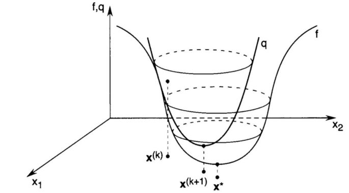
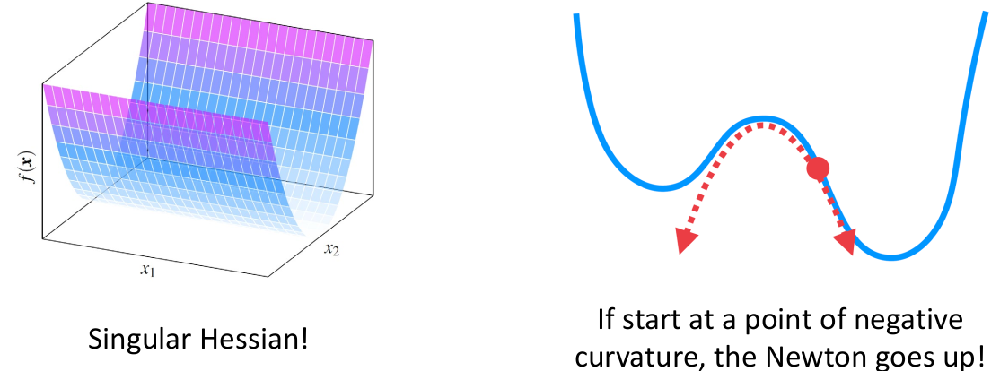

# 数值优化-牛顿法

## 牛顿法
牛顿法的基本思路为，利用原函数在 $\boldsymbol{x}$ 处的二阶泰勒展开来近似：
$$
f(\boldsymbol{x}) \approx \hat{f}(\boldsymbol{x}) \triangleq f\left(\boldsymbol{x}_k\right)+\nabla f\left(\boldsymbol{x}_k\right)^T\left(\boldsymbol{x}-\boldsymbol{x}_k\right)+\frac{1}{2}\left(\boldsymbol{x}-\boldsymbol{x}_k\right)^T \nabla^2 f\left(\boldsymbol{x}_k\right)\left(\boldsymbol{x}-\boldsymbol{x}_k\right)
$$
然后，求这个近似的二次函数的极小值点，
$$
\begin{aligned}
& \nabla \hat{f}(\boldsymbol{x})=\nabla^2 f\left(\boldsymbol{x}_k\right)\left(\boldsymbol{x}-\boldsymbol{x}_k\right)+\nabla f\left(\boldsymbol{x}_k\right)=\mathbf{0} \\
& \Longrightarrow \boldsymbol{x}=\boldsymbol{x}_k-\left[\nabla^2 f\left(\boldsymbol{x}_k\right)\right]^{-1} \nabla f\left(\boldsymbol{x}_k\right)
\end{aligned}
$$
为了保证求得的为极小而非极大，需要海森矩阵正定(PD)： $\nabla^2 f\left(\boldsymbol{x}_k\right) \succ \boldsymbol{O}$。  
将该极小值点作为下次迭代的起点，则可得**牛顿迭代公式**：
$$
\boldsymbol{x}_{k+1}=\boldsymbol{x}_k-\left[\nabla^2 f\left(\boldsymbol{x}_k\right)\right]^{-1} \nabla f\left(\boldsymbol{x}_k\right)
$$
由于该二次函数在 $\boldsymbol{x}$ 附近近似原函数，因此极小值点处的 $\boldsymbol{x}_{k+1}$ 能让原函数较为充分的下降。

我们主要从三方面来衡量一个数值优化方法：
1. 收敛速度
2. 稳定性
3. 每次迭代的计算量

**对于牛顿法，虽然迭代次数很少，但每次迭代都要求海森矩阵的逆，因此计算量大，计算效率低。**  
**另外，迭代时需要保证每一步的海森矩阵正定，但实际难以保证，导致求解不稳定。**

我们可以通过**修正后的阻尼牛顿法**来改善牛顿法的效率和稳定性。
## 修正阻尼牛顿法

修正阻尼牛顿法流程如下:
$$
\begin{aligned}
&\text{initialize}\quad\boldsymbol{x}\leftarrow\boldsymbol{x}_{0}\in\mathbb{R}^{n} \\
&\text{while}\quad \Vert\nabla f(\boldsymbol{x})\Vert>\delta\quad\text{do} \\
&\qquad \boldsymbol{d}\leftarrow-\boldsymbol{M}^{-1}\nabla f(\boldsymbol{x}) \\
&\qquad t\leftarrow\text{backtracking line search} \\
&\qquad \boldsymbol{x}\leftarrow \boldsymbol{x}+t\boldsymbol{d}\\
&\text{end while} \\
&\text{return}
&&
\end{aligned}
$$
核心：
+ 选择一个接近海森阵的正定矩阵 $\boldsymbol{M}$。
+ 不求矩阵的逆，而是通过矩阵分解求解线性方程组得到下降方向 $\boldsymbol{d}$。
+ 线搜索无需梯度和海森阵。

为了求得下降方向 $\boldsymbol{d}$，需要求矩阵 $\boldsymbol{M}$ 的逆，但求逆操作十分耗时。因此，为了提高计算效率，直接求解线性方程组 $\boldsymbol{Md}=\nabla f(\boldsymbol{x})$，即
$$
\left[\nabla^2 f(\boldsymbol{x})\right] \boldsymbol{d}=-\nabla f(\boldsymbol{x})
$$
另外，当海森阵为半正定(PSD)或不定时，问题的条件很差。此时，为了保证矩阵正定，我们选择一个与海森阵相近的矩阵 $\boldsymbol{M}$:
+ 当函数 $f(x)$ 为**凸函数**时，海森阵一定半正定，此时$$\boldsymbol{M}=\nabla^2 f(\boldsymbol{x})+\epsilon \boldsymbol{I}, \epsilon=\min \left(1,\|\nabla f(\boldsymbol{x})\|_{\infty}\right) / 10$$
  一定正定。（证明见后）  
  然后，可以通过 Cholesky 分解来求解线性方程组，从而得到下降方向 $\boldsymbol{d}$：
  $$\boldsymbol{M} \boldsymbol{d}=-\nabla f(\boldsymbol{x}), \boldsymbol{M}=\boldsymbol{L} \boldsymbol{L}^{\mathrm{T}}$$
+ 当函数 $f(x)$ **非凸**时，海森阵不定。因此，我们先将海森阵进行 Bunch-Kaufman 分解：$$\boldsymbol{H}=\boldsymbol{L}\boldsymbol{B}\boldsymbol{L}^{\mathrm{T}}$$
  其中 $\boldsymbol{B}$ 为一个块对角矩阵 $[b_1, b_2, \cdots, b_n]$，其中每个块为正实数 $b_i \in R^+ \geq 0$ 或特征值一正一负的二阶方阵 $b_i\in R^{2\times 2}$。对每个二阶方阵进行调整，使得特征值全为正，得到 $\boldsymbol{\tilde{B}}$，从而得到正定阵
  $$\boldsymbol{M}=\boldsymbol{L} \boldsymbol{\tilde{B}} \boldsymbol{L}^{\mathrm{T}}$$
  这样，就可求解线性方程组
  $$\boldsymbol{M d}=-\nabla f(\boldsymbol{x}), \boldsymbol{M}=\boldsymbol{L} \boldsymbol{\tilde{B}} \boldsymbol{L}^{\mathrm{T}}$$
## 附录
*若 $\nabla^2 f(\boldsymbol{x})$ 半正定，则 $\boldsymbol{M}=\nabla^2 f(\boldsymbol{x})+\epsilon \boldsymbol{I}$ 正定。*  

**证明：**  
由于 $\nabla^2 f(\boldsymbol{x})$ 半正定，则对于 $\forall \boldsymbol{x}\neq 0$，有 $\boldsymbol{x}^\top \nabla^2 f(\boldsymbol{x}) \boldsymbol{x}\geq 0$。则
$$
\boldsymbol{x}^\top\boldsymbol{M}\boldsymbol{x}=\boldsymbol{x}^\top(\nabla^2 f(\boldsymbol{x})+\epsilon\boldsymbol{I})\boldsymbol{x}=\boldsymbol{x}^\top \nabla^2 f(\boldsymbol{x}) \boldsymbol{x}+\boldsymbol{x}^\top \epsilon\boldsymbol{I}\boldsymbol{x}> 0
$$
因此，$\boldsymbol{M}$ 正定。
