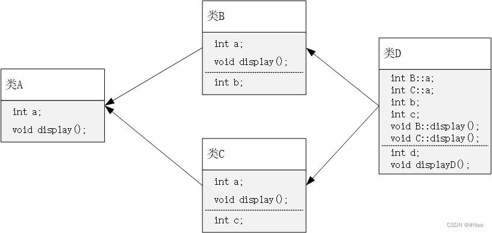

# 秋招八股整理

## C++
### 多态
定义： 同一事物表现出不同事物的能力。（**重载实现编译时多态，虚函数实现运行时多态**）  
功能：允许将父对象设置成和一个或更多他的子对象相等的技术，赋值后，父对象会根据当前赋值给它的子对象特性以不同方式运作。**允许将子类指针赋值给父类指针**  。
实现方式：
+ **覆盖（override)**：子类重新定义父类的虚函数
+ **重载（overload)**：允许存在多个同名函数，而函数的参数表不同

狭义：继承+虚函数实现的多态。

### 虚函数（虚函数表、虚函数指针、实现原理）
表象：基类函数加上`virtual`关键字，在派生类中重写该函数，运行时会根据对象实际类型调用相应函数。

**虚函数表**：
+ 当类中包含虚函数时，编译器为该类**生成虚函数表，保存虚函数地址**。
+ 派生类继承基类，编译器**为派生类生成自己的虚函数表**。

**虚函数指针**：
+ 定义一个类对象时，**编译器检测有虚函数，为该对象生成一个虚函数指针，指向该类型的虚函数表**，虚函数指针的初始化在构造函数中完成。
+ 若有基类指针指向派生类，**调用虚函数时，会根据所指对象的虚函数指针找到对应的虚函数表，从而找虚函数地址**。

**编译器对虚函数表的处理**：
对于派生类，编译器建立虚函数表一共三步：
1. **拷贝**基类的虚函数表，若是**多继承，则拷贝每个有虚函数基类的虚函数表**
2. 当然还有⼀个基类的虚函数表和派⽣类⾃身的虚函数表共⽤了⼀个虚函数表，也称为某个基类为派⽣类的主基类。
3. 查看派生类中是否有重写基类的虚函数，若有，就替换成重写的虚函数地址
4. 查看派生类是否有自己的虚函数，若有，则将自身虚函数加到虚函数表中（主基类的表后）

**析构函数一般写为虚函数**：降低内存泄漏。  
举例：一个基类指针指向派生类对象，若基类析构函数没有定义为虚函数，则销毁时仅执行基类的析构函数，派生类内容无法析构，导致内存泄露。若定义为虚函数，则会先执行派生类的析构，再执行基类析构，成功释放内存。

**构造函数一般不定义为虚函数**：  
+ 虚函数调用只需“部分”信息，即只需知道函数接口，无需对象的具体类型；但创建对象是需要知道对象的完整信息的，特别是确切类型。
+ 从编译器实现虚函数进行多态的方式看，虚函数的调用是通过实例化对象后对象的虚函数表指针来找到虚函数地址进行调用，在构造前虚函数指针不存在，若构造函数为虚，则无法找到对应的虚函数表，违反了先实例再调用的准则。

**不应该在构造或析构函数中调用虚函数：**
+ 创建派生类对象时，会先创建基类部分，执行基类的构造函数，此时派生类部分还未被创建，因此编译器认为这就是一个基类类型，调用基类中的虚函数。
+ 派生类对象执行析构，会先析构派生类部分，派生类自身成员呈现未定义状态，此时执行基类的析构不可能调用派生类重写的方法。

### final 和 override

c++借由虚函数实现运行时多态，但有脆弱的地方：
+ 无法禁止子类重写
+ 容易隐藏父类的虚函数，如重写时声明了一个签名不一致但有同样名称的新函数

**final**：禁止虚函数被重写，禁止类被继承  
**override**：显式重写

### default 和 delete
c++会自动为类生成方法，如构造、析构函数
+ default:：显式指定方法的自动生成
+ delete：显式禁止自动生成

### explicit
仅对单参数的构造函数有效，可以禁止类型的隐式转换。  
单参数的构造函数可以根据指定对象创建本类对象，有时候会发生隐式的类型转换，如
```cpp
class A {
	A(int n) {}
};

int main() {
	A a = 4;
	return 0;
}
```
此时会隐式的通过`A(4)`创建对象，即隐式地发生了类型转换。  
通过`explicit`可以禁止这类隐式转换。


### 虚基类

A是B、C的基类，而B、C又是D的基类，此时，类D会继承B与C的多份同名成员。  
也就是说，在**继承共同间接基类时，会保留多份数据成员的拷贝**，不仅占用内存，还会增加访问成员时的难度。  
**虚基类**可以**继承共同间接基类时只保留一份成员。**
### 左值和右值
**左值**：可以放在等号左边，**可以取地址**，有名字，表达式结束依然存在 。  
**右值**：不能放在等号左边，**不能取地址**，没名字 ，表达式结束不存在。

字符串字面值“abcd”是左值。

**++i、--i是左值，i++、i--是右值。**

**将亡值**：即将销毁的值，通过盗取其他变量内存空间生存，常用来完成移动构造，如`T&&`函数返回值、`std::move()`返回值和转换为`T&&`类型的转换函数的返回值。

**左值引用**：对左值进行引用，是对象的别名；不拥有绑定对象的堆存，所以必须立即初始化；等号右边必须可以取地址，否则编译失败。

**右值引用**：等号右边的值需要是右值，可以使用`std::move`函数强制把左值转换为右值。右值引用特性允许对右值进行修改，借此实现移动语义。

左值和右值独立于类型，右值引用可能是左值，也可能是右值。  
编译器会将已命名的右值引用视为左值，未命名的右值引用视为右值。

**移动语义**：
+ 转移所有权（转让、资源窃取），将资源转为自己所有，别人不再拥有也不会再使用。
+ 当用右值进行构造时，直接从右值拿数据来初始化/修改左值，不需要先构造左值再析构右值。
+ 通过移动构造函数使用移动语义，也就是`std:move`；移动语义仅针对实现了移动构造函数的类和对象；若没有移动构造函数，则无任何优化作用。
+ 浅拷贝：数据的简单赋值，对于指针、引用仍指向同一块内存
+ 深拷贝：若被拷贝对象内部还有指针引用指向其他资源，则需重新开辟一块新内存

对于一个具体的类型，如`string`，
```cpp
void my_copy(const string& str) {
  string x = str;
}
```
`const string&`为常左值引用，可以匹配左值和右值：
+ 匹配左值时，为常左值引用
+ 匹配右值时，优先为右值引用实现移动语义，但也可以为常左值引用
```cpp
void my_copy(string&& str) {
  string x = str;
}
```
`string&&`只能匹配右值

对于函数模板的的类型参数`T`，`T&&`成为了**universal reference**。  
**universal reference:**
```cpp
template<typename T>
void calc(T&& t) {
  T x = std::forward<T>(t);
}
```
此时，`T&&`既可以传递左值，又可以传递右值，配合完美转发`std::forward`来使用，可将参数转发给其他函数，并保持左值为左值，右值为右值。

`auto&&`和`T&&`都是未定的引用类型，都是universal reference，取决于初始化的值类型。

**完美转发**：写一个接受任意实参的函数模板，并转发到其他函数，目标函数会收到与转发函数完全相同的实参，通过`std::forward`实现。  
如果没有完美转发，
```cpp
template<typename T>
void calc(T&& t) {
  T x = t;  // 这里的t为左值
}
```
在函数中直接使用了右值的名称，则右值会变为左值。

在一个模板类的成员函数中，
```cpp
template<typename T>
class Person {
 public:
  void eat(T&& t);
}
```
`T&&`只能接受右值，因为在创建类的时候，`T`的类型就确定了，确定类型的右值引用只能匹配右值。

**右值引用叠加到右值引用仍是右值引用，其他引用折叠都为左值引用。**

### 智能指针
智能指针是用于管理指针的类，可以**在特定情况下自动释放内存空间，无需手动释放**，避免忘记释放导致的内存泄露。

**auto_ptr**：C++11废弃，所有权模式
```cpp
auto_ptr<std::string> p1 (new string ("hello"));
auto_ptr<std::string> p2;
p2 = p1; //auto_ptr 不会报错.
```
`p2`剥夺了`p1`的所有权，再次访问`p1`会报错，因此**存在潜在的内存崩溃**问题。

**unique_ptr**：替换auto_ptr
```
unique_ptr<string> p3 (new string (auto));//#4
unique_ptr<string> p4； //#5
p4 = p3;//此时会报错
```
+ **独占式**，严格拥有，**同一时间只有一个智能指针能指向该对象**，对于避免泄露很有用，比auto_ptr更安全。
+ 不支持普通的拷贝和赋值，但可以通过`release`或`reset`将指针从一个unique_ptr转移到另一个unique_ptr。

**shared_ptr**：共享型，强引用。  
+ **共享式拥有**，多个智能指针能指向相同对象，该对象和其相关资源会**在“最后一个引用”被销毁时释放**，使用**计数机制**来表明资源被几个指针共享。  
+ 可通过`use_count`函数来查看所有者个数。  
+ 调用`release()`时会释放所有权，计数减一。计数为0时资源释放。  
+ shared_ptr 是为了**解决 auto_ptr 在对象所有权上的局限性** (auto_ptr 是独占的)，在使⽤引⽤计数的机制上提供了可以共享所有权的智能指针。
+ **线程安全**：
	+ 同一个shared_ptr被多个线程**读**是**安全**
	+ 同一个shared_ptr被多个线程**写**是**不安全**
	+ 共享引⽤计数的不同的shared_ptr被多个线程”写“ 是安全的

**weak_ptr**：弱引用  
+ **不控制对象生命周期**，**只提供对管理对象的一个访问手段**，**构造和析构不会引起计数的增加或减少**。  
+ 它只能从shared_ptr和weak_ptr对象构造，指向一个shared_ptr管理的对象，但只有shared_ptr会管理对象内存。可以和shared_ptr相互转化， shared_ptr可以直接赋值给它，它可以调用`lock`获得shared_ptr。  
+ weak_ptr的目的是配合shared_ptr工作，解决shared_ptr相互引用时的死锁问题。若shared_ptr相互引⽤，析构时两个资源引⽤计数会减⼀，但是两者引⽤计数还是为 1，资源没有被释放。将其中一个改为weak_ptr即可。

### Lambda表达式
Lambda表达式提供了类似**匿名函数**的特性。
+ 可编写内嵌的匿名函数，以替换独立函数或函数对象
+ 本质上是语法糖，只是为了简化语法
+ 返回值可自动推导，也可指定
```cpp
// 指明返回类型，托尾返回类型
auto add = [](int a, int b) -> int { return a + b; };
// ⾃动推断返回类型
auto multiply = [](int a, int b) { return a * b; };
int sum = add(2, 5); // 输出： 7
int product = multiply(2, 5); // 输出： 10
```
`[]`是lambda表达式的重要功能，**闭包**。

原理：定义一个lambda表达式，自动生成一个匿名类（重载了`()`运算符），称为闭包类型。  
运行时，lambda表达式返回一个匿名的闭包实例（**右值**）。  

闭包**可通过传值或引用的方式捕捉其封装作用域内的变量**，而`[]`就是用来定义捕捉模式及变量的，又称为**lambda捕捉块**。

lambda表达式的**捕获类型**：
+ []：默认不捕获任何变量；
+ [=]：默认以值捕获所有变量；
+ [&]：默认以引⽤捕获所有变量；
+ [x]：仅以值捕获x，其它变量不捕获；
+ [&x]：仅以引⽤捕获x，其它变量不捕获；
+ [=, &x]：默认以值捕获所有变量，但是x是例外，通过引⽤捕获；
+ [&, x]：默认以引⽤捕获所有变量，但是x是例外，通过值捕获；
+ [this]：通过引⽤捕获当前对象（其实是复制指针）；
+ [*this]：通过传值⽅式捕获当前对象；

**lambda表达式的重要应用：可用于函数参数，从而实现回调函数**，如STL算法中通过lambda表达式给出条件。

### using namespace std 和 using std::cin
+ `using namespace std`在当前作用域引入`std`命名空间的所有成员，可能导致命名冲突。
+ `using std::cin`只将`std`命名空间的`cin`引入当前作用域，避免了引入不需要的成员。

### 内存分配情况
+ 栈：局部变量、函数参数
+ 堆：由程序员管理，手动分配和回收（new, malloc, free, delete），空间较大，但可能出现内存泄露和空闲碎片的情况
+ 全局/静态存储区：分为初始化和未初始化两个区，存放初始化和未初始化的全局和静态变量
+ 常量存储区：存储常量，一般不允许修改
+ 代码区：存放程序的二进制代码

### const

**const修饰基本数据类型**：const可在类型说明符前，也可在说明符后。在使用常量时，只要不改变常量值即可。

**const修饰指针变量和应用变量**：
+ const在\*的左侧：修饰指针所指向的变量，即指针指向为常量
+ const在\*的右侧：修饰指针本身，即指针本身为常量

**const用在函数中**：
+ 修饰参数：调用函数时，用相应的变量初始化const常量，在函数体中，按照const所修饰的部分进行常量化，保护原对象属性（通常用于参数为指针或引用的情况）
+ 修饰返回值：声明返回值后，const按照“修饰原则”进行能修饰，起到相应的保护作用。（通常用于返回值是指针或引用，此时返回右值，返回内容不能被修改

**const在类中**：
+ const成员变量：在某个对象生命周期内是常量，而对于整个类来说可以改变。一个类可以创建多个对象，不同对象的const成员的值可以不同。不能在类的声明中初始化const成员，因为类的对象在没有创建的时候，编译器不知道const数据成员的值是什么，初始化只能在构造函数的初始化列表中进行。
+ const成员函数：防止成员函数修改对象内容，不能修改对象的数据成员，不能调用非const成员函数。

**const修饰类对象，定义常量对象**：只能调用常量函数
+ 原因：调用成员函数时，会在形参列表的最前面加一个形参`this`，类型为`TEST* const this`，指向当前对象；常量成员函数的隐式`this`类型为`const TEST* const this`；若在常量函数中调用非常量函数，就需要将`const TEST* const this`赋值给`TEST* const this`，这是非法的。

**补充**：
+ const成员函数，如果实在想修改某个变量，可以用`mutable`进行修饰
+ 成员变量中，如果想建立在整个类中都恒定的常量，应该用类中的枚举常量或`static const`

### static

控制变量的存储方式和可见性。

**修饰局部变量**：一般的局部变量存放在栈区，生命周期在包含语句快结束时便结束了。若用`static`修饰，变量会存放在静态存储区，生命周期会延续到整个程序结束，但作用域仍限制在语句块内。

**修饰全局变量**：对于一个全局变量，它既可在本文件中被访问，又能在同一个工程中的其他文件被访问。用`static`进行修饰，改变了作用域范围，由整个工程可见变成了本文件可见。

**修饰函数**：和全局变量类似，改变了函数作用域。

**修饰类**：
+ `static`修饰函数：该函数属于整个类而不是属于此类的任何特定对象，不接受`this`指针，因此只能访问`static`成员变量；不能被`virtual`修饰，因为不属于任何对象或实例，加上`virtual`没有意义（没有`this`指针，虚函数的实现是为每一个对象分配一个虚函数指针，而虚函数指针通过`this`调用）
+ `static`修饰变量：该变量被整个累拥有，存储空间中只存在一个副本，可通过类和对象去调用。由于该变量先于对象存在，因此要在类外初始化。

**补充**：静态非常量数据成员，只能在类外定义和初始化，类内仅声明

### 指针参数传递和引用参数传递

**指针参数传递本质上是值传递**，传递的是一个地址值。
+ 值传递过程中，被调函数的形参作为局部变量处理，会在栈中开辟内存空间，存放主调函数传进来的实参值，即实参的一个副本。
+ 值传递的特点：任何对形参的操作都不会影响主调函数中的实参变量。

**引用参数传递**过程中
+ 被调函数的形参也作为局部变量，在栈中开辟内存空间，但存放的是由主调函数传进的实参变量的地址。
+ 被调函数对形参的任何操作都被处理成间接寻址，通过栈中存放的地址访问主调函数中的实参变量，影响主调函数的实参变量。

**指针传递和引用传递是不同的**，虽然都是被调函数栈空间的局部变量，但
+ 任何对于引用参数的处理都会通过间接寻址的方式操作到主调函数中的相关变量
+ 对于指针传递的参数，改变被调函数中的指针地址，应用不到主调函数的相关变量

**从编译的角度**：程序在编译时将指针和引用添加到符号表上，符号表记录变量名和变量所对应的地址。
+ 指针变量在符号表上，地址值为指针变量的地址
+ 引用在符号表上，对应所引用对象的地址
+ 符号表生成后不会再改，因此指针可以改变其指向的对象，而引用对象则不能


### 深拷贝和浅拷贝

默认拷贝构造：成员的一一复制（浅拷贝），在数据成员中没有指针时可行。  
若成员中含有指针，则两类中的指针指向同一个地址，对象快结束时，调用两次析构，导致重复释放。  
深拷贝会在堆内存中另外申请空间来存储数据，从而解决野指针的问题。

### 构造/析构函数的执行顺序
+ 构造函数：基类构造（派生表顺序）->成员对象构造（声明顺序）->派生类构造
+ 析构函数：派生类析构->成员对象析构->基类析构

### 构造函数
作用：初始化对象的数据成员
+ 无参数构造函数：默认构造，若没有明确写出，则编译器会自动生成默认的无参构造，函数为空，什么也不做。
+ 一般构造函数：重载构造，可以有各种参数形式
+ 拷贝构造函数：参数为对象本身的引用，根据一个已存在的对象复制出新的对象，一般会将已存在对象的数据成员一一复制到新创建的对象中。如果没有显式写，则会生成默认的拷贝构造（浅拷贝，有指针成员时最好自己定义深拷贝）
+ 类型转换构造：根据指定类型对象创建本类对象，属于一般构造函数，若不允许默认转换，应声明为`explict`，阻止隐式转换发生
+ 赋值运算符重载：类似拷贝构造，但不属于构造函数，`=`两边对象必须已经创建。

### 拷贝构造函数

何时调用：
+ 对象以值传递的方式传入函数体，需要拷贝构造函数创建一个临时对象压入栈空间。
+ 对象以值传递的方式从函数返回，需执行拷贝构造创建一个临时对象作为返回值。
+ 一个对象需通过另一个对象进行初始化。

必须引用传递而非值传递：
+ 防止递归调用。值传递时，会调用拷贝构造函数生成一个副本，若拷贝构造函数为值传递，则又需要为了创建拷贝构造函数需要的临时对象，又一次调用拷贝构造函数，无限递归。

### nullptr
**替代NULL**。

传统c++会将NULL和0视为同一种东西，这取决于编译器如何定义NULL，有些会定义为0，有些会定义为`((void*)0)`，重载可能发生混乱。

引入nullptr，区分空指针和0。nullptr的类型为nullptr_t，能隐式转换为任何指针类型，也能进行相等和不相等的比较。

### std::vector
动态数组。

**扩容机制**：两倍扩容，分配更大内存，拷贝原数据，释放原内存

**resize**：改变数组的size，可能改变capacity，存在数据填充
+ n<=size：将数组size变为n，多余的数据丢失
+ size<n<=capacity：将数组size变为n，并填充（若没有指定，则填充默认值）
+ n>capacity：先扩容capacity至n，再扩容size，并填充（分配新内存，拷贝原数据，新增元素）

**reserve**：指定数组的capacity，不改变数组size
+ n<capacity：不进行任何操作
+ n>capacity：扩容capacity至n（分配新内存，拷贝原数据）

|              | push_back | emplace_back |
| ------------ | --------- | ------------ |
| 右值引用     | 支持      | 支持         |
| 拷贝构造     | 一定      | 不一定       |
| 多个构造参数 | 一个      | 多个         |
| 原地构造     | 不支持    | 支持             |


**push_back**：
+ 传入构造参数：先构造临时对象，再拷贝构造，再析构临时对象
+ 传入已有对象：拷贝构造
+ 传入临时对象：拷贝构造，析构临时对象
+ 传右值：移动构造

**emplace_back**：
+ 可传入多个构造参数
+ 原地构造：输入构造参数，直接在容器内构造

**使用注意**：
+ 插入删除元素后，迭代器失效
+ 清空时，若保存的数据是指针，需手动delete

### STL迭代器和指针
把不同集合类的访问逻辑抽象出来，提供一种方式顺序访问容器中的元素，而不暴露内部结构

**和指针的区别**：迭代器是类模版，模拟了指针的一些功能，封装了指针，提供了比指针更高级的行为，可根据不同类型的数据结构实现不同的++/--操作

### STL迭代器删除元素
+ 对于序列容器，erase后，后边的每个元素的迭代器都失效，但erase会返回下一个有效的迭代器
+ 对于关联容器，erase后当前迭代器失效，下一个元素的不会失效，在删除前记录下一个元素迭代器即可
+ 对于list，内存分配不连续，erase会返回下一个有效的iterator，上两种方法都行

